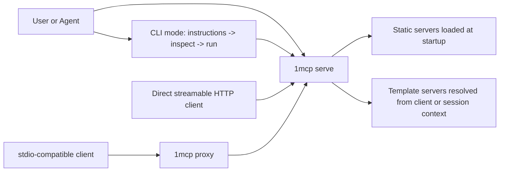

# 1MCP

[](https://www.npmjs.com/package/@1mcp/agent)
[](https://www.npmjs.com/package/@1mcp/agent)
[](https://github.com/1mcp-app/agent/actions/workflows/github-code-scanning/codeql)
[](https://github.com/1mcp-app/agent/stargazers)
[](https://docs.1mcp.app)
[](https://deepwiki.com/1mcp-app/agent)
[](https://www.npmjs.com/package/@1mcp/agent)

1MCP is the unified MCP runtime. `1mcp serve` aggregates your MCP servers, and CLI mode adds a thinner agent-facing workflow for Codex, Claude, Cursor, and similar tool-using agents.

## Why 1MCP

Most MCP setups eventually hit two kinds of sprawl:

- Configuration sprawl: every client needs its own MCP wiring, auth choices, and filtering rules.
- Agent sprawl: autonomous sessions carry too many tools and schemas into context up front.

1MCP addresses both:

- `1mcp serve` gives you one aggregated runtime in front of many MCP servers.
- CLI mode lets agents discover tools progressively with `instructions`, `inspect`, and `run`.
- Static servers can load at startup, while template servers are created from per-client or per-session context.
- Presets, filters, and instruction aggregation keep the same runtime adaptable across clients and projects.

| Approach               | Best for                             | Tradeoff                                                                         |
| ---------------------- | ------------------------------------ | -------------------------------------------------------------------------------- |
| 1MCP CLI mode          | Codex, Claude, agent loops           | Requires a running `1mcp serve` instance                                         |
| 1MCP stdio proxy       | Maximum compatibility across clients | Still depends on `serve`, and auth-capable HTTP clients have a more direct path  |
| Direct streamable HTTP | MCP-native HTTP clients              | No project context, no `.1mcprc`, and a broader tool surface is exposed directly |
| Custom proxying        | One-off compatibility shims          | You own discovery, filtering, auth, and runtime lifecycle                        |

## Quick Start for Agent Users

This page is optimized for AI agent users. The 5-minute outcome is simple: start a real `1mcp serve` runtime, connect your agent with `cli-setup`, then verify the `instructions -> inspect -> run` workflow.

Install 1MCP, add one upstream server, and start the runtime:

```bash
npm install -g @1mcp/agent
1mcp mcp add context7 -- npx -y @upstash/context7-mcp
1mcp serve
```

In a second shell, connect your agent to CLI mode:

```bash
1mcp cli-setup --codex
# or
1mcp cli-setup --claude --scope repo --repo-root .
```

Then verify the agent workflow:

```bash
# shell 1
1mcp serve

# shell 2
1mcp instructions
1mcp inspect context7
1mcp inspect context7/query-docs
1mcp run context7/query-docs --args '{"libraryId":"/mongodb/docs","query":"aggregation pipeline"}'
```

If you want the full walkthrough (with success criteria and off-ramps), use the [Quick Start guide](https://docs.1mcp.app/guide/quick-start).

For a given agent, choose one mode only. If you switch that agent to CLI mode, remove its old direct MCP configuration first.

## Why CLI Mode Exists

CLI mode is the primary workflow for agent-style sessions. It keeps MCP as the backend protocol but narrows what the agent sees at each step:

- `instructions` explains the current runtime and recommended flow
- `inspect` lets the agent discover only the server or tool it needs
- `run` executes one selected tool after schema inspection

That gives agent loops a smaller working surface without giving up the unified runtime behind `1mcp serve`.

## Choose Another Path

### Stdio Proxy

Use [`1mcp proxy`](https://docs.1mcp.app/commands/proxy) when you want the broadest client compatibility without giving up project context.

It is the recommended fallback after CLI mode because it:

- works with the stdio transport that most AI clients already support
- keeps project context through `.1mcprc`
- supports template MCP servers resolved from project or session context
- is easier to roll out with one-time global setup plus per-project config

Direct stdio mode is not the recommended path. It is mainly useful for debugging because 1MCP startup is slower than a thin standalone stdio setup.

### Direct MCP Attachment

Direct MCP attachment is still supported for clients that want to talk to the aggregated runtime over streamable HTTP.

Examples:

```json
{
  "mcpServers": {
    "1mcp": {
      "url": "http://127.0.0.1:3050/mcp?app=cursor"
    }
  }
}
```

```bash
claude mcp add -t http 1mcp "http://127.0.0.1:3050/mcp?app=claude-code"
```

Use this path if your client already speaks MCP natively, can work without project context, and you do not want CLI mode. For Codex, Claude, Cursor, and similar agent loops, prefer CLI mode first and `proxy` second.

### Runtime Operators

Use the deeper docs if you are configuring or deploying the runtime itself:

- [Configuration](https://docs.1mcp.app/guide/essentials/configuration)
- [Authentication](https://docs.1mcp.app/guide/advanced/authentication)
- [Architecture](https://docs.1mcp.app/reference/architecture)

### Contributors

- [Development guide](https://docs.1mcp.app/guide/development)
- [CONTRIBUTING.md](CONTRIBUTING.md)

## How It Works



1MCP runs as an aggregated runtime behind `1mcp serve`. Static servers are prepared from startup configuration, template servers are materialized when client context is known, and the runtime can use async loading and lazy loading to reduce startup blocking and tool-surface noise. Instruction aggregation, presets, and notifications sit alongside that runtime rather than outside it.

## Core Capabilities

- Unified runtime for many MCP servers behind one `serve` process
- CLI mode for progressive discovery with `1mcp instructions`, `1mcp inspect <server>`, `1mcp inspect <server>/<tool>`, and `1mcp run <server>/<tool> --args '<json>'`
- Template servers for per-client or per-session resolution
- Async loading and lazy loading for faster startup and narrower exposure
- Instruction aggregation across static and template-backed servers
- Presets, filters, and preset change notifications
- `proxy` for maximum compatibility with project context and template-server support
- Direct streamable HTTP MCP access for native HTTP clients that do not need project context

## Common Use Cases

- Give a coding agent one stable runtime but a smaller working surface.
- Share the same MCP inventory across Cursor, Claude Code, Codex, and internal tooling.
- Expose context-specific template servers per repo, branch, or session.
- Centralize auth, filtering, presets, and runtime lifecycle instead of rebuilding them in ad hoc scripts.

## Contributing / License

Contributions are welcome. See [CONTRIBUTING.md](CONTRIBUTING.md) for the development workflow and [LICENSE](LICENSE) for the Apache 2.0 license.
