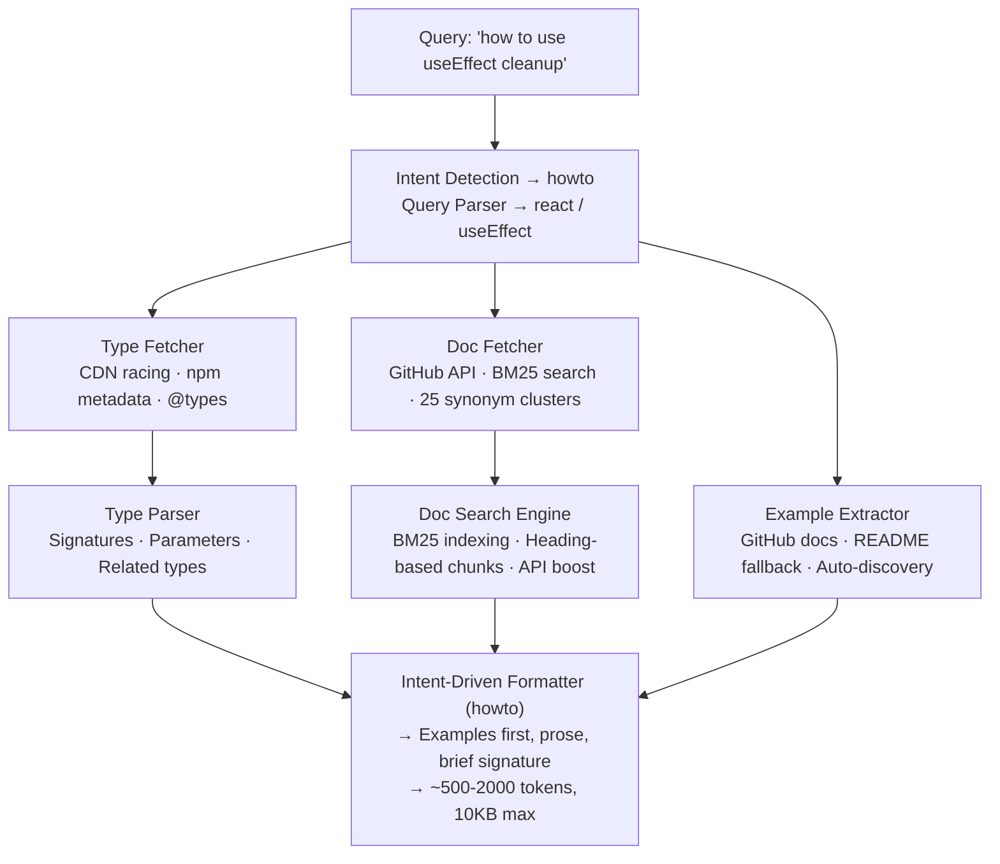

A next-generation framework documentation provider for Claude Code via Model Context Protocol (MCP). Returns **types + prose + examples** with context-aware formatting for **any** npm package — not just curated ones.

mcp-name: dev.augments/mcp

## What's New in v7

**Version 7.0** is the biggest upgrade yet — documentation-first search, 4 new tools, BM25 indexing, and production-grade reliability.

| v6 | v7 |
|----|-----|
| 3 tools | 8 tools (+ diagnostics) |
| Types-only search | Documentation-first BM25 search |
| 8 concept synonyms | 25 concept synonym clusters |
| Generic version diffs | Real changelog-backed breaking changes |
| No migration guides | Cross-version migration guides |
| No error diagnosis | Curated error patterns + GitHub Issues |
| No package comparison | Side-by-side package comparison |
| No dep scanning | Dependency scanner (outdated/deprecated/security) |
| FIFO caches | LRU caches with hit/miss stats |
| Fixed retry delays | Exponential backoff + circuit breaker |

## Quick Start

### Claude Code

```bash
# Add the MCP server (runs locally via npx)
claude mcp add -s user augments -- npx -y @augmnt-sh/augments-mcp-server

# Verify configuration
claude mcp list
```

### Cursor

Add to your MCP config:

```json
{
  "mcpServers": {
    "augments": {
      "command": "npx",
      "args": ["-y", "@augmnt-sh/augments-mcp-server"]
    }
  }
}
```

### Environment Variables

Set `GITHUB_TOKEN` for higher GitHub API rate limits when fetching examples and documentation:

```json
{
  "mcpServers": {
    "augments": {
      "command": "npx",
      "args": ["-y", "@augmnt-sh/augments-mcp-server"],
      "env": {
        "GITHUB_TOKEN": "ghp_your_token_here"
      }
    }
  }
}
```

### Usage

```
# Get API context with prose + examples (recommended first tool)
@augments get_api_context query="useEffect cleanup" framework="react"

# Natural language queries work great
@augments get_api_context query="how to use zustand middleware"

# Search for APIs by concept (synonym-aware)
@augments search_apis query="state management"

# Get version info with real breaking changes
@augments get_version_info framework="react" fromVersion="18" toVersion="19"

# Migration guide between versions
@augments get_migration_guide package="next" fromVersion="14" toVersion="15"

# Diagnose an error
@augments diagnose_error error="Objects are not valid as a React child" package="react"

# Compare packages side-by-side
@augments compare_packages packages=["zod", "yup", "joi"]

# Scan project dependencies
@augments scan_project_deps
```

## Tools

| Tool | Description |
|------|-------------|
| `get_api_context` | **Primary tool.** Returns API signatures, prose documentation, and code examples for any npm package. Handles natural language queries with intent detection. Now with documentation-first BM25 search. |
| `search_apis` | Search for APIs across frameworks by keyword or concept. 25 synonym clusters ("state" matches useState, createStore, atom, etc). |
| `get_version_info` | Get npm version info, compare versions, and detect breaking changes backed by real changelogs. |
| `get_migration_guide` | **New.** Cross-version migration guide with breaking changes, new features, deprecations, type diffs, and official migration docs. |
| `diagnose_error` | **New.** Diagnose errors using curated patterns, GitHub Issues search, and troubleshooting docs. |
| `compare_packages` | **New.** Compare 2-5 npm packages: downloads, bundle size, GitHub stars, dependencies, exported APIs. |
| `scan_project_deps` | **New.** Scan package.json for outdated, deprecated, and insecure dependencies. |
| `diagnostics` | Server health: version, uptime, memory, cache stats, Node.js version. |

## Architecture



### Source Structure

```
src/
├── cli.ts                   # stdio entry point
├── server.ts                # MCP server (8 tools + diagnostics)
├── core/                    # Core modules
│   ├── query-parser.ts      # Parse natural language → framework + concept
│   ├── type-fetcher.ts      # Fetch .d.ts + README from npm/unpkg/jsdelivr
│   ├── type-parser.ts       # Parse TypeScript, extract signatures, synonym search
│   ├── example-extractor.ts # Fetch examples from GitHub docs + auto-discovery
│   ├── version-registry.ts  # npm registry integration + changelog-backed diffs
│   ├── doc-fetcher.ts       # GitHub documentation fetcher
│   ├── doc-search.ts        # BM25 inverted index search engine
│   ├── changelog-fetcher.ts # CHANGELOG.md + GitHub Releases parser
│   ├── type-differ.ts       # .d.ts diff between versions
│   └── error-patterns.ts    # Curated error pattern database
├── tools/v4/                # MCP tools
│   ├── get-api-context.ts   # Primary tool (types + docs + examples)
│   ├── search-apis.ts       # Cross-framework API search
│   ├── get-version-info.ts  # Version comparison
│   ├── get-migration-guide.ts # Cross-version migration guides
│   ├── diagnose-error.ts    # Error diagnosis
│   ├── compare-packages.ts  # Package comparison
│   └── scan-project-deps.ts # Dependency scanner
└── utils/
    ├── logger.ts            # stderr logger
    └── lru-cache.ts         # Generic LRU cache with stats
```

## Key Features

### Documentation-First Search (New in v7)
Queries like "prisma findMany with pagination" and "zustand create store with middleware" now return real documentation content. The BM25 search engine indexes docs fetched from GitHub by heading-based chunks, with API name boosting and synonym expansion.

### Concept Synonyms
25 synonym clusters cover state, form, fetch, animation, routing, auth, cache, effect, middleware, pagination, validation, testing, streaming, error handling, database, layout, modal, table, upload, realtime, deployment, i18n, SSR, component, and context patterns. Bidirectional lookup means "usestate" expands to the "state" cluster.

### Intent-Aware Formatting
| Intent | Trigger | Format |
|--------|---------|--------|
| `howto` | "how to", "example of", "guide" | Examples → prose → brief signature |
| `reference` | "signature", "types", "parameters" | Full signature → related types → 1 example |
| `migration` | "migrate", "upgrade", "breaking" | Prose → signature → examples |
| `balanced` | Default | Signature → prose → examples |

### Production Reliability (New in v7)
- **Exponential backoff with jitter** for npm registry retries, with 429 Retry-After support
- **CDN circuit breaker** — skips repeatedly failing CDN endpoints (3 failures / 5 min)
- **GitHub rate limiting** — tracks remaining quota, skips fetches when exhausted
- **LRU caches** with hit/miss statistics across all cache-using modules

## Coverage

### Any npm Package
Every npm package is supported out of the box — no curation or configuration needed. Augments resolves documentation automatically through four layers:

1. **Documentation search** — fetches real docs from GitHub repos, indexes with BM25
2. **TypeScript types** — bundled (`"types"` in package.json) or DefinitelyTyped (`@types/*`)
3. **Auto-discovered docs** — parses the npm `repository` field, finds the GitHub repo, probes `docs/` directories
4. **README fallback** — extracts concept-relevant code blocks and prose from `README.md`

This means augments works with the entire npm ecosystem (~2.5M packages), not just a curated subset.

### Enhanced Results for Popular Frameworks
22 frameworks have curated doc sources for richer examples: React, Next.js, Vue, Prisma, Zod, Supabase, TanStack Query, tRPC, React Hook Form, Framer Motion, Express, Zustand, Jotai, Drizzle, SWR, Vitest, Playwright, Fastify, Hono, Solid, Svelte, Angular, Redux

### Barrel Export Handling
Special sub-module resolution for: React Hook Form, TanStack Query, Zustand, Jotai, tRPC, Drizzle ORM, Next.js

## Local Development

```bash
# Clone and install
git clone https://github.com/augmentscode/augments-mcp-server.git
cd augments-mcp-server
npm install

# Build with tsup
npm run build

# Run locally
npm start

# Watch mode
npm run dev

# Run tests
npm test

# Run e2e tests (real network calls)
npm run test:e2e

# Type check
npm run type-check
```

## How Augments Compares to Context7

| Aspect | Context7 | Augments v7 |
|--------|----------|-------------|
| **Source** | Parsed prose docs | Types + BM25-indexed docs + README |
| **Accuracy** | Docs can be wrong | Types must be correct, docs supplement |
| **Context size** | ~5-10KB chunks | ~500-2000 tokens (intent-aware) |
| **Coverage** | Manual submission | Any npm package (auto-discovery) |
| **Format** | One-size-fits-all | Intent-aware (how-to vs reference) |
| **Search** | Keyword match | BM25 + 25 concept synonym clusters |
| **Freshness** | Crawl schedule | On-demand from npm + GitHub |
| **Migration** | No | Cross-version migration guides |
| **Error help** | No | Curated patterns + GitHub Issues |
| **Dep scanning** | No | Outdated/deprecated/security checks |

## Contributing

1. Fork the repository
2. Create a feature branch: `git checkout -b feature/amazing-feature`
3. Make your changes
4. Run tests: `npm test`
5. Submit a pull request

## License

MIT License - see [LICENSE](LICENSE) for details.

## Support

- [GitHub Issues](https://github.com/augmentscode/augments-mcp-server/issues)
- [GitHub Discussions](https://github.com/augmentscode/augments-mcp-server/discussions)

---

**Built for the Claude Code ecosystem** | **Version 7.0.0**
