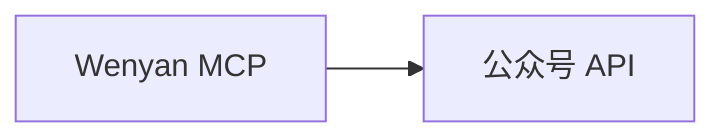
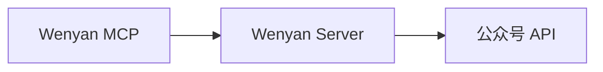

<div align="center">
    
</div>

# 文颜 MCP Server

[](https://www.npmjs.com/package/@wenyan-md/mcp)
[](LICENSE)

[](https://hub.docker.com/r/caol64/wenyan-mcp)
[](https://github.com/caol64/wenyan-mcp)

## 简介

**[文颜（Wenyan）](https://wenyan.yuzhi.tech)** 是一款多平台 Markdown 排版与发布工具，支持将 Markdown 一键转换并发布至：

-   微信公众号
-   知乎
-   今日头条
-   以及其它内容平台（持续扩展中）

文颜的目标是：**让写作者专注内容，而不是排版和平台适配**。

## 文颜的不同版本

文颜目前提供多种形态，覆盖不同使用场景：

-   [macOS App Store 版](https://github.com/caol64/wenyan) - MAC 桌面应用
-   [跨平台桌面版](https://github.com/caol64/wenyan-pc) - Windows/Linux
-   [CLI 版本](https://github.com/caol64/wenyan-cli) - 命令行 / CI 自动化发布
-   👉 [MCP 版本](https://github.com/caol64/wenyan-mcp) - 本项目

## 文颜 MCP Server 是什么？

简单来说，它打通了“AI 写作”与“公众号发文”的通道。

基于 MCP 协议，Claude Desktop 等 AI 客户端现在可以直接调用文颜（Wenyan）的排版引擎。写完文章后，不需要再去第三方编辑器里来回复制粘贴，直接让 AI 帮你排版并塞进微信草稿箱。

**核心特性：**

- **绕过排版工具**：AI 生成的 Markdown 直接转成微信富文本并上传，省去中间步骤。
- **对话式排版**：直接打字跟 AI 说“换个橙色风格主题”，样式自动生效。
- **不出窗口完成闭环**：在同一个聊天框里，顺滑搞定“想选题 -> 写文章 -> 调排版 -> 存草稿”的所有操作。

**实战演示**：
*   [让 AI 帮你管理公众号的排版和发布](https://babyno.top/posts/2025/06/let-ai-help-you-manage-your-gzh-layout-and-publishing/)
*   [Moraya MCP 使用案例：微信公众号全托管](https://github.com/zouwei/moraya/wiki/Moraya-MCP-%E4%BD%BF%E7%94%A8%E6%A1%88%E4%BE%8B%EF%BC%9A%E5%BE%AE%E4%BF%A1%E5%85%AC%E4%BC%97%E5%8F%B7%E5%85%A8%E6%89%98%E7%AE%A1)

## 功能特性

- 一键发布 Markdown 到微信公众号草稿箱
- 自动上传本地图片与封面
- 支持远程 Server 发布（绕过 IP 白名单限制）
- 内置多套精美排版主题
- 支持自定义主题
- 提供标准 MCP Tool 接口
- 支持 AI 自动调用：
  - 渲染 Markdown
  - 主题管理
  - 发布草稿

## 快速开始

**安装**

```bash
npm install -g @wenyan-md/mcp
```

**Claude Desktop 配置 (claude_desktop_config.json)：**：

```json
{
  "mcpServers": {
    "wenyan-mcp": {
      "command": "wenyan-mcp",
      "env": {
        "WECHAT_APP_ID": "your_app_id",
        "WECHAT_APP_SECRET": "your_app_secret"
      }
    }
  }
}
```

## 基本用法

### 列出主题

对AI说

> 目前你可以使用哪些公众号主题？

AI回复：

```
目前我支持的公众号主题包括以下这些，每个主题都有独特的风格和配色，适用于不同的内容调性：

1. **Default（默认）**  
   简洁经典的排版，适合长文阅读，通用性强。

2. **OrangeHeart（橙心）**  
   暖橙色调，优雅而富有活力，适合情感、生活类内容。
...
```

### 注册主题

对AI说

> 帮我把这个css(https://wenyan.yuzhi.tech/manhua.css)注册为一个新的公众号主题，名称为：xiuluochang

AI回复：

```
好的，已成功将 CSS 样式表注册为新的公众号主题，主题名称为：**xiuluochang**。

您现在可以在公众号后台选择该主题进行应用，样式将按照 `https://wenyan.yuzhi.tech/manhua.css` 的定义进行渲染。

如有需要进一步自定义或更换主题，随时告诉我！
```

### 删除主题

对AI说

> 把名为“xiuluochang”的公众号主题删除

AI回复：

```
公众号主题 “xiuluochang” 已成功删除。
```

### 发布文章

对AI说

> 使用phycat主题将这篇文章发布到微信公众号：`./tests/publish.md`

AI回复：

```
文章已成功发布至微信公众号草稿箱！🎉

- **主题**：phycat  
- **媒体ID**：xxx

您可登录微信公众号后台，在「草稿箱」中查看并编辑文章，确认无误后即可一键发布。如需进一步排版优化、添加封面或设置摘要，我也可以协助您完成！

是否需要我帮您生成一篇发布文案或封面建议？ 😊
```

## 概念

### 环境变量配置

> [!IMPORTANT]
>
> 请确保 MCP 启动时已配置如下环境变量，否则上传接口将调用失败。

-   `WECHAT_APP_ID`
-   `WECHAT_APP_SECRET`

### 微信公众号 IP 白名单

> [!IMPORTANT]
>
> 请确保运行文颜的机器 IP 已加入微信公众号后台的 IP 白名单，否则上传接口将调用失败。

配置说明文档：[https://yuzhi.tech/docs/wenyan/upload](https://yuzhi.tech/docs/wenyan/upload)

### 文章格式

为了正确上传文章，每篇 Markdown 顶部需要包含一段 `frontmatter`：

```md
---
title: 在本地跑一个大语言模型(2) - 给模型提供外部知识库
cover: /Users/xxx/image.jpg
author: xxx
source_url: http://
---
```

字段说明：

| 字段         | 必填 | 说明                |
| ---------- | -- | ----------------- |
| title      | ✅  | 文章标题              |
| cover      | ❌  | 封面图片（本地路径或网络 URL） |
| author     | ❌  | 作者                |
| source_url | ❌  | 原文链接              |
| type       | ❌  | 文章类型，设为 `image` 表示图片消息（小绿书） |
| image_list | ❌  | 图片路径列表（小绿书专用，最多 20 张） |
| need_open_comment | ❌  | 是否打开评论 |
| only_fans_can_comment | ❌  | 是否仅粉丝可评论 |

说明：

* 如果未指定 cover，将自动使用正文第一张图片作为封面
* cover 支持本地路径和网络 URL
* `type` 和 `image_list` 用于图片消息发布

**[示例文章](tests/publish.md)**

### 文内图片和文章封面

把文章发布到公众号之前，文颜会按照微信要求自动处理文章内的所有图片，将其上传到公众号素材库。目前文颜对于以下图片都能很好的支持：

- 本地硬盘绝对路径（如：`/Users/xxx/image.jpg`）
- 网络路径（如：`https://example.com/image.jpg`）
- 当前文章的相对路径（如：`./assets/image.png`）

## 发布图片消息（小绿书）

发布图片消息与发布图文消息的区别在于 frontmatter 中需要指定图片列表。支持两种方式：

### 方式一：使用 type: image（推荐）

在 frontmatter 中设置 `type: image`，CLI 会自动从正文中提取所有图片：

```md
---
title: 人勤春来早，读书正当时
type: image
---


```

### 方式二：手动指定 image_list

直接在 frontmatter 中列出图片路径：

```md
---
title: 人勤春来早，读书正当时
image_list:
  - ./1.jpeg
  - ./2.jpeg
  - ./3.jpeg
  - ./4.jpeg
  - ./5.jpeg
---
```

`image_list` 最多 20 张，首张即为封面。

## Server 模式

相较于纯本地运行的**本地模式（Stdio Mode）**，`wenyan-mcp`还提供了 **远程客户端模式（Client–Server Mode）**。两种模式运行效果完全一致，你可以根据运行环境和网络条件选择最合适的方式。

在本地模式下，MCP 直接调用微信公众号 API 完成图片上传和草稿发布。



在远程客户端模式下，MCP 作为客户端，将发布请求发送到部署在云服务器上的 Wenyan Server，由 Server 完成微信公众号 API 调用。



**适用于：**

* 无本地固定 IP，需频繁添加IP 白名单的用户
* 需团队协作的用户
* 支持 CI/CD 自动发布
* 支持 AI Agent 自动发布

**[Server 模式部署](https://github.com/caol64/wenyan-cli/blob/main/docs/server.md)**

**Claude Desktop 配置：**：

```json
{
  "mcpServers": {
    "wenyan-mcp": {
      "command": "wenyan-mcp",
      "args": ["--server", "https://api.example.com", "--api-key", "your-api-key"]
    }
  }
}
```

## 多公众号发布（进阶）

> [!IMPORTANT]
>
> 必须使用`server`模式才能使用多公众号发布功能。

步骤：

- 首先部署`server`
- 在`server`端配置多个微信凭据，参考[文档](https://github.com/caol64/wenyan-cli)
- 让`MCP 客户端`连接`server`

对AI说

> 使用phycat主题将这篇文章发布到微信公众号(your_app_id)：`./tests/publish.md`

## Docker 部署

适合不希望安装 Node.js 环境的用户。

```bash
docker pull caol64/wenyan-mcp:latest
```

* **Claude Desktop 配置：**：

```json
{
  "mcpServers": {
    "wenyan-mcp": {
      "command": "docker",
      "args": [
        "run",
        "--rm",
        "-i",
        "-v", "/your/host/file/path:/mnt/host-downloads",
        "-e", "WECHAT_APP_ID=your_app_id",
        "-e", "WECHAT_APP_SECRET=your_app_secret",
        "-e", "HOST_FILE_PATH=/your/host/file/path",
        "caol64/wenyan-mcp"
      ]
    }
  }
}
```

> **Docker 配置特别说明：**
>
> *   **挂载目录 (`-v`)**：必须将宿主机的文件/图片目录挂载到容器内的 `/mnt/host-downloads`。
> *   **环境变量 (`HOST_FILE_PATH`)**：必须与宿主机挂载的文件/图片目录路径保持一致。
> *   **原理**：你的 Markdown 文件/文章内所引用的本地图片应放置在该目录中，Docker 会自动将其映射，使容器能够读取并上传。

## 如何调试

推荐使用官方 Inspector 进行调试：

```bash
npx @modelcontextprotocol/inspector <command>
```

启动成功出现类似提示：

```bash
🔗 Open inspector with token pre-filled:
   http://localhost:6274/?MCP_PROXY_AUTH_TOKEN=761c05058aa4f84ad02280e62d7a7e52ec0430d00c4c7a61492cca59f9eac299
   (Auto-open is disabled when authentication is enabled)
```

访问以上链接即可打开调试页面。


1. 正确填写启动命令
2. 添加环境变量
3. 点击 Connect
4. 选择 Tools -> List Tools
5. 选择要调试的接口
6. 填入参数并点击 Run Tool
7. 查看完整参数

## 赞助

如果你觉得文颜对你有帮助，可以给我家猫咪买点罐头 ❤️

[https://yuzhi.tech/sponsor](https://yuzhi.tech/sponsor)

## License

Apache License Version 2.0
