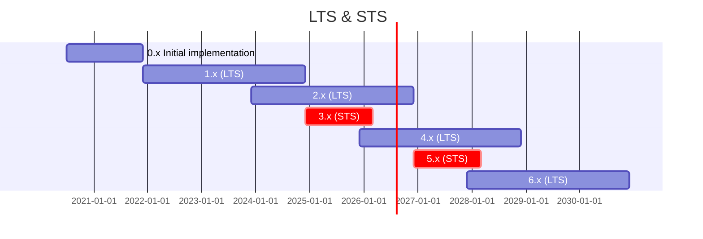

# Welcome to KoliBri

[](https://www.npmjs.com/package/@public-ui/components)
[](https://github.com/public-ui/kolibri/blob/main/LICENSE)
[](https://www.npmjs.com/package/@public-ui/components)
[](https://github.com/public-ui/kolibri/issues)
[](https://github.com/public-ui/kolibri/pulls)
[](https://bundlephobia.com/result?p=@public-ui/components)


> "The accessible HTML standard"

KoliBri is **not a design system** in the traditional sense. Rather, we extend the HTML5 standard with self-contained, accessible Web Components — new HTML elements that work independently from any design or branding. These atomic components form a foundation that any design library, framework, or style guide can reuse and theme according to their needs.

**KoliBri** stands for "component library for accessibility" and was released as
open source by the
[Informationstechnikzentrum Bund (ITZBund)](https://itzbund.de) for reuse and
continued development.

## Vision

Together we make **HTML** accessible using **reusable web components** to ensure **usability** and **accessibility**.

## Mission

The [HTML web standard](https://html.spec.whatwg.org) is itself very “openly” specified in order to be as long-lasting and robust as possible. It therefore often happens that HTML compositions are not easily accessible, semantic and valid.

KoliBri is based directly on the [Web standards](https://www.w3.org/standards/webdesign/) of the [W3C](https://www.w3.org) (framework-agnostic), and is generic Reference implementation of the [WCAG standard](https://www.w3.org/WAI/standards-guidelines/wcag/) and the [BITV](https://www.bitvtest.de/bitv_test.html) for accessibility and implemented as a multi-theming capable presentation layer. There is no technical reference and no data transfer functionality. This means that KoliBri is equally reusable for the realization of static websites as well as dynamic web applications with different corporate designs and style guides and is therefore very interesting for open source.

## Roadmap

KoliBri is always actively working on improvements, new features and future-oriented innovations for the latest major release. In parallel, a selected LTS release is maintained with regard to bug fixes.

| Version | Release type | Release  | Period | End-of-Support |
| ------: | :----------: | :------: | :----: | :------------: |
|     0.x |   Initial    | Jul 2020 |   -    |    Dec 2021    |
|     1.x |     LTS      | Dec 2021 |   3y   |    Dec 2024    |
|     2.x |     LTS      | Dec 2023 |   3y   |    Dec 2026    |
|     3.x |     STS      | Dec 2024 |  15m   |    Mar 2026    |
|     4.x |     LTS      | Dec 2025 |   3y   |    Dec 2028    |
|     5.x |     STS      | Dec 2026 |  15m   |    Mar 2028    |



## Installation

Install the packages with [pnpm](https://pnpm.io):

```bash
pnpm install
```

Run the build once to generate the components:

```bash
pnpm -r build
```

### Quick start

Install the default theme and register the components:

```ts
pnpm add @public-ui/components @public-ui/theme-default

import { register } from '@public-ui/components';
import { defineCustomElements } from '@public-ui/components/loader';
import { DEFAULT } from '@public-ui/theme-default';

register(DEFAULT, defineCustomElements);
```

### Avoid CSS Custom Property Collisions

KoliBri themes expose a few CSS custom properties so consumers can adapt the look and feel.
Because these properties remain global—even inside a Shadow DOM—using too many of them can
clash with variables defined on the host page.

Use namespaced custom properties only for values that must be overridden from the outside.
For internal calculations rely on SASS variables instead of additional CSS properties.
This keeps components robust and prevents unexpected style leaks.

## Collaboration and cooperation

The **focus** of KoliBri is on **small** (atomic), very **flexible** and highly **reusable** HTML compositions (e.g. buttons). We offer an accessible, semantic and valid standard implementation of such components that can be reused for any higher-level HTML structure or component (molecule, organism or template).
These atomic components are where we should **collaborate** and **cooperate** to combine our skills and knowledge. The synergy effects on the basic components allow you to focus more on subject-specific content.

Let's make KoliBri **better** and **more colorful** together!

> Continue [to **Documentation**](https://public-ui.github.io/en/)…

## Contributing

Bug reports and pull requests are welcome. Please read our [contribution guide](./CONTRIBUTING.md) before getting started.

## SLSA/Provenance

We aim for **SLSA Build Level 3** for the npm packages published from this repository. Releases are built in GitHub Actions with OIDC-based identity and published with npm provenance (`--provenance`), producing verifiable attestations for the published artifacts. See the [publish workflow](./.github/workflows/publish.yml) for the release steps and npm provenance configuration.

**Verification example**

```bash
# Inspect provenance metadata for a published package
pnpm view @public-ui/components dist.provenance

# (Optional) Verify signatures/provenance if your npm client supports it
pnpm audit signatures --package=@public-ui/components@<version>
```

## Resources

- [Get Started](https://public-ui.github.io/en/docs/get-started/first-steps)
- [Contributing](./CONTRIBUTING.md)
- [Code of Conduct](./CODE_OF_CONDUCT.md)
- [Known Issues](http://public-ui.github.io/en/docs/known-issues)
- [Security](./docs/SECURITY.md)
