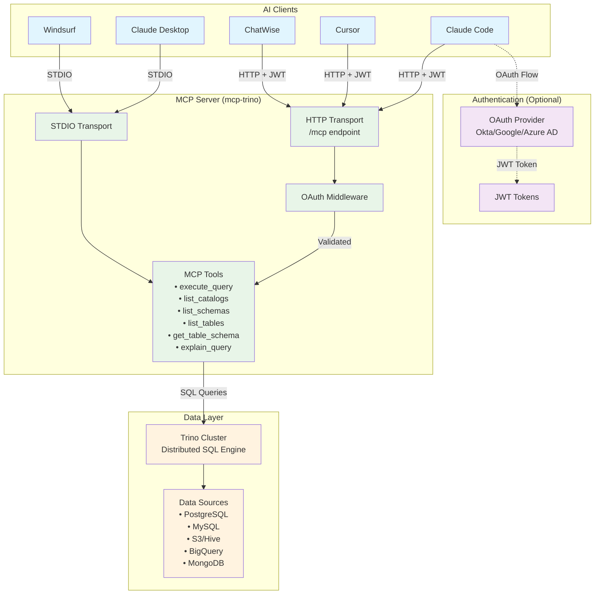

# Trino MCP Server in Go

A high-performance Model Context Protocol (MCP) server for Trino implemented in Go. This project enables AI assistants to seamlessly interact with Trino's distributed SQL query engine through standardized MCP tools.

[](https://github.com/tuannvm/mcp-trino/actions/workflows/build.yml)
[](https://github.com/tuannvm/mcp-trino/blob/main/go.mod)
[](https://github.com/tuannvm/mcp-trino/actions/workflows/build.yml)
[](https://slsa.dev)
[](https://goreportcard.com/report/github.com/tuannvm/mcp-trino)
[](https://pkg.go.dev/github.com/tuannvm/mcp-trino)
[](https://github.com/tuannvm/mcp-trino/pkgs/container/mcp-trino)
[](https://github.com/tuannvm/mcp-trino/releases/latest)
[](https://opensource.org/licenses/MIT)

[](https://archestra.ai/mcp-catalog/tuannvm__mcp-trino)

## Overview

This project implements a Model Context Protocol (MCP) server for Trino in Go. It enables AI assistants to access Trino's distributed SQL query engine through standardized MCP tools.

Trino (formerly PrestoSQL) is a powerful distributed SQL query engine designed for fast analytics on large datasets.

## Architecture



**Key Components:**

- **AI Clients**: Various MCP-compatible applications
- **Authentication**: Optional OAuth 2.0 with OIDC providers
- **MCP Server**: Go-based server with dual transport support
- **CLI Mode**: Interactive SQL shell for direct Trino access (psql-like)
- **Data Layer**: Trino cluster connecting to multiple data sources

## Features

- ✅ **Dual Mode**: Works as both MCP server AND interactive CLI
  - **CLI Mode**: psql-like interactive SQL shell for direct Trino access
  - **MCP Mode**: Full MCP server for AI assistant integration
- ✅ MCP server implementation in Go
- ✅ Trino SQL query execution through MCP tools
- ✅ Catalog, schema, and table discovery
- ✅ Docker container support
- ✅ Supports both STDIO and HTTP transports
- ✅ OAuth 2.1 authentication via [oauth-mcp-proxy](https://github.com/tuannvm/oauth-mcp-proxy) library
  - **4 Providers**: HMAC, Okta, Google, Azure AD
  - **Native mode**: Client handles OAuth directly (zero server-side secrets)
  - **Proxy mode**: Server proxies OAuth flow for simple clients
  - **Production-ready**: Token caching, PKCE, defense-in-depth security
  - **Reusable**: OAuth library available for any Go MCP server
- ✅ StreamableHTTP support with JWT authentication (upgraded from SSE)
- ✅ Backward compatibility with SSE endpoints
- ✅ Compatible with Cursor, Claude Desktop, Windsurf, ChatWise, and any MCP-compatible clients.
- ✅ User Identity Tracking:
  - **Query Attribution** (automatic): Tags queries with OAuth user via `X-Trino-Client-Tags/Info` headers
  - **User Impersonation** (opt-in): Execute queries as OAuth user via `X-Trino-User` header

## Installation & Quick Start

**Install:**

```bash
# Homebrew
brew install tuannvm/mcp/mcp-trino

# Or one-liner (macOS/Linux)
curl -fsSL https://raw.githubusercontent.com/tuannvm/mcp-trino/main/install.sh | bash
```

**Run (Local Development):**

```bash
export TRINO_HOST=localhost TRINO_USER=trino
mcp-trino
```

For production deployment with OAuth, see [Deployment Guide](docs/deployment.md) and [OAuth Architecture](docs/oauth.md).

## CLI Mode

mcp-trino can be used as an interactive CLI similar to `psql` or the Trino CLI:

```bash
# Interactive REPL mode
mcp-trino --interactive

# Execute a query directly
mcp-trino query "SELECT * FROM my_table LIMIT 10"

# List catalogs, schemas, tables
mcp-trino catalogs
mcp-trino schemas my_catalog
mcp-trino tables my_catalog my_schema

# Describe a table
mcp-trino describe my_catalog.my_schema.my_table

# Explain a query
mcp-trino explain "SELECT COUNT(*) FROM my_table"

# Output formats
mcp-trino --format json query "SELECT 1"
mcp-trino --format csv query "SELECT 1"
mcp-trino --format table query "SELECT 1"  # default
```

### Built-in Help

Every command has structured, LLM-friendly help output:

```bash
# Main help with all commands, flags, examples, and environment variables
mcp-trino --help

# Per-subcommand help
mcp-trino query --help
mcp-trino describe --help
```

Help output follows Unix man-page conventions with sections: NAME, SYNOPSIS, DESCRIPTION, COMMANDS, FLAGS, EXAMPLES, ENVIRONMENT, and CONFIGURATION.

### Exit Codes

| Code | Meaning |
|------|---------|
| 0 | Success |
| 1 | Runtime error (connection failed, query error, etc.) |
| 2 | Usage error (unknown command, invalid flags, missing arguments) |

### Named Profiles

mcp-trino supports named connection profiles for easy switching between Trino environments.

**Configuration File** — supports both YAML (`~/.config/trino/config.yaml`) and JSON (`~/.config/trino/config.json`):

```yaml
# ~/.config/trino/config.yaml
current: prod

profiles:
  prod:
    host: trino.example.com
    port: 443
    user: prod_user
    password: prod_password
    catalog: hive
    schema: analytics
    ssl:
      enabled: true
      insecure: false

  dev:
    host: localhost
    port: 8080
    user: trino
    catalog: memory
    schema: default

  staging:
    host: staging-trino.example.com
    port: 443
    user: staging_user

output:
  format: table
```

Or equivalently in JSON:

```json
{
  "current": "prod",
  "profiles": {
    "prod": {
      "host": "trino.example.com",
      "port": 443,
      "user": "prod_user",
      "catalog": "hive",
      "ssl": { "enabled": true }
    },
    "dev": {
      "host": "localhost",
      "port": 8080,
      "user": "trino"
    }
  },
  "output": { "format": "table" }
}
```

When both files exist, `config.json` takes precedence. New configs default to JSON.

**Profile Management Commands:**

```bash
# List all profiles
mcp-trino config profile list

# Set default profile
mcp-trino config profile use prod

# Show profile details
mcp-trino config profile show staging

# Use a specific profile (overrides config file)
mcp-trino --profile dev catalogs
```

**Configuration Precedence** (highest to lowest):
1. CLI flags (`--host`, `--port`, etc.)
2. `--profile` flag
3. `TRINO_PROFILE` environment variable
4. `current` field in config file
5. `default` profile fallback
6. Environment variables (`TRINO_HOST`, etc.)

**Environment Variables** (lowest priority - overridden by profiles and flags):

```bash
export TRINO_HOST=trino.example.com
export TRINO_PORT=443
export TRINO_USER=myuser
export TRINO_PASSWORD=mypass
export TRINO_CATALOG=hive
export TRINO_SCHEMA=analytics
export TRINO_SSL=true
```

**Secret Management** (recommended):

Secrets are loaded purely from environment variables. Use a secrets CLI to inject them via Unix piping at launch time — the app never touches your vault:

```bash
# 1Password CLI — resolves op:// references in an env file
op run --env-file=.env -- mcp-trino

# Or inline per-variable
TRINO_PASSWORD=$(op read 'op://Engineering/Trino/password') mcp-trino
```

See [docs/secrets.md](docs/secrets.md) for 1Password, Vault, and Kubernetes patterns, and for security nuances (shell-history, process-list, and env-var leakage).

**REPL Meta-Commands** (in interactive mode):
- `\help` - Show help
- `\quit`, `\exit`, `\q` - Exit REPL
- `\history` - Show command history
- `\catalogs` - List all catalogs
- `\schemas [catalog]` - List schemas
- `\tables [catalog schema]` - List tables
- `\describe <table>` - Describe table
- `\format <table|json|csv>` - Change output format

## Usage

**Supported Clients:** Claude Desktop, Claude Code, Cursor, Windsurf, ChatWise

**Available Tools:** `execute_query`, `list_catalogs`, `list_schemas`, `list_tables`, `get_table_schema`, `explain_query`

For client integration and tool documentation, see [Integration Guide](docs/integrations.md) and [Tools Reference](docs/tools.md).

## Configuration

**Key Variables:** `TRINO_HOST`, `TRINO_USER`, `TRINO_SCHEME`, `MCP_TRANSPORT`, `OAUTH_PROVIDER`

**Secret Management:** Inject secrets through the process environment — `mcp-trino` reads them directly. See [docs/secrets.md](docs/secrets.md) for 1Password, Vault, and Kubernetes recipes.

```bash
# 1Password (biometric-gated, zero disk writes)
op run --env-file=.env -- mcp-trino

# Vault (via vault-agent or CLI)
TRINO_PASSWORD=$(vault kv get -field=password secret/mcp-trino) mcp-trino

# Kubernetes: use standard Secret → envFrom in the Helm chart values
```

**OAuth Configuration:**

```bash
# Native mode (most secure - zero server-side secrets)
export OAUTH_ENABLED=true OAUTH_MODE=native OAUTH_PROVIDER=okta
export OIDC_ISSUER=https://company.okta.com OIDC_AUDIENCE=https://mcp-server.com

# Proxy mode (centralized credential management)
export OAUTH_MODE=proxy OIDC_CLIENT_ID=app-id OIDC_CLIENT_SECRET=secret
export OAUTH_REDIRECT_URI=https://mcp-server.com/oauth/callback  # Fixed mode (localhost-only)
export OAUTH_REDIRECT_URI=https://app1.com/cb,https://app2.com/cb  # Allowlist mode
export JWT_SECRET=$(openssl rand -hex 32)  # Required for multi-pod deployments
```

**Performance Optimization:**

```bash
# Focus AI on specific schemas only (10-20x performance improvement)
export TRINO_ALLOWED_SCHEMAS="hive.analytics,hive.marts,hive.reporting"
```

**User Identity Tracking:**

```bash
# Query Attribution is AUTOMATIC when OAuth is enabled
# Queries are tagged with X-Trino-Client-Tags and X-Trino-Client-Info headers

# For full impersonation (Trino enforces user permissions):
export TRINO_ENABLE_IMPERSONATION=true
export TRINO_IMPERSONATION_FIELD=email  # Options: username, email, subject
```

For complete configuration, see [Deployment Guide](docs/deployment.md), [OAuth Guide](docs/oauth.md), [Allowlists Guide](docs/allowlists.md), and [User Identity Guide](docs/impersonation.md).

## OAuth Implementation

mcp-trino uses [oauth-mcp-proxy](https://github.com/tuannvm/oauth-mcp-proxy) - a standalone OAuth 2.1 library for Go MCP servers.

**Why a separate library?**
- ✅ Reusable across any Go MCP server
- ✅ Independent testing and versioning
- ✅ Dedicated documentation and examples
- ✅ Community-maintained OAuth implementation

**For OAuth details:**
- [oauth-mcp-proxy Documentation](https://github.com/tuannvm/oauth-mcp-proxy#readme) - Complete OAuth guide
- [Provider Setup Guides](https://github.com/tuannvm/oauth-mcp-proxy/tree/main/docs/providers) - Okta, Google, Azure AD
- [Security Best Practices](https://github.com/tuannvm/oauth-mcp-proxy/blob/main/docs/SECURITY.md) - Production security

## Contributing

Contributions are welcome! Please feel free to submit a Pull Request.

## License

This project is licensed under the MIT License - see the LICENSE file for details.

## Related Projects

- **[oauth-mcp-proxy](https://github.com/tuannvm/oauth-mcp-proxy)** - OAuth 2.1 authentication library used by mcp-trino (reusable for any Go MCP server)

## CI/CD and Releases

This project uses GitHub Actions for continuous integration and GoReleaser for automated releases.

### Continuous Integration Checks

Our CI pipeline performs the following checks on all PRs and commits to the main branch:

#### Code Quality

- **Linting**: Using golangci-lint to check for common code issues and style violations
- **Go Module Verification**: Ensuring go.mod and go.sum are properly maintained
- **Formatting**: Verifying code is properly formatted with gofmt

#### Security

- **Vulnerability Scanning**: Using govulncheck to check for known vulnerabilities in dependencies
- **Dependency Scanning**: Using Trivy to scan for vulnerabilities in dependencies (CRITICAL, HIGH, and MEDIUM)
- **SBOM Generation**: Creating a Software Bill of Materials for dependency tracking
- **SLSA Provenance**: Creating verifiable build provenance for supply chain security

#### Testing

- **Unit Tests**: Running tests with race detection and code coverage reporting
- **Build Verification**: Ensuring the codebase builds successfully

#### CI/CD Security

- **Least Privilege**: Workflows run with minimum required permissions
- **Pinned Versions**: All GitHub Actions use specific versions to prevent supply chain attacks
- **Dependency Updates**: Automated dependency updates via Dependabot

### Release Process

When changes are merged to the main branch:

1. CI checks are run to validate code quality and security
2. If successful, a new release is automatically created with:
   - Semantic versioning based on commit messages
   - Binary builds for multiple platforms
   - Docker image publishing to GitHub Container Registry
   - SBOM and provenance attestation
