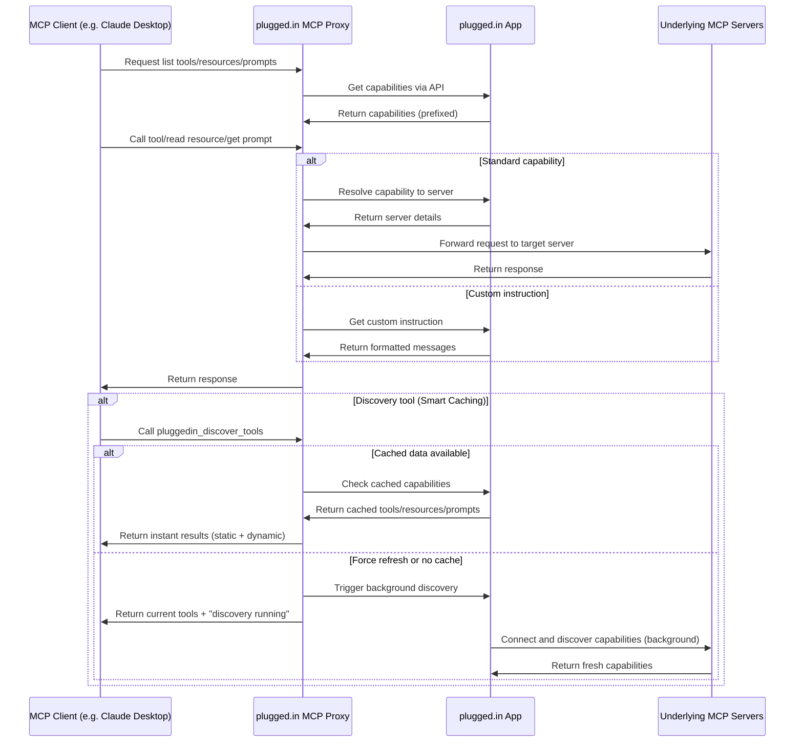

# plugged.in MCP Hub — Proxy · Knowledge · Memory · Tools

<div align="center">
  
  <h3>The Crossroads for AI Data Exchanges</h3>
  <p>A unified MCP hub that gives your AI <strong>Knowledge</strong>, <strong>Memory</strong>, and <strong>Tools</strong> — not just a proxy. Manage and test all MCP servers from a single connection while powering document-aware and memory-augmented workflows across clients.</p>

  [](https://smithery.ai/server/@VeriTeknik/pluggedin-mcp)
  [](https://github.com/VeriTeknik/pluggedin-mcp/releases)
  [](https://github.com/VeriTeknik/pluggedin-mcp/stargazers)
  [](LICENSE)
  [](https://www.typescriptlang.org/)
  [](https://modelcontextprotocol.io/)
  [](https://lobehub.com/mcp/veriteknik-pluggedin-mcp)
</div>

## 📋 Overview

The plugged.in MCP Proxy Server is a powerful middleware that aggregates multiple Model Context Protocol (MCP) servers into a single unified interface. It fetches tool, prompt, and resource configurations from the [plugged.in App](https://github.com/VeriTeknik/pluggedin-app) and intelligently routes requests to the appropriate underlying MCP servers.

This proxy enables seamless integration with any MCP client (Claude, Cline, Cursor, etc.) while providing advanced management capabilities through the plugged.in ecosystem.

## Hub Pillars: Knowledge · Memory · Tools · Proxy

**Knowledge (RAG v2 / AI Document Exchange)**  
Search and ground model outputs with unified, attribution‑aware document retrieval. MCP servers can create and manage documents in your library with versioning, visibility controls, and model attribution. Use the built‑in RAG to search across all connected sources and return relevant snippets and metadata.

**Memory (Persistent AI Memory)**  
Long‑lived, workspace/profile‑scoped memory that survives sessions. The hub integrates with the plugged.in App's persistent memory so agent actions and insights can be stored and recalled across tasks. Built‑in memory tools are on the roadmap to expose low‑friction `get/put/search` patterns under the same auth model.

**Tools**  
Aggregate built‑in capabilities with downstream MCP servers (STDIO, SSE, Streamable HTTP). Tool discovery is cached and can be refreshed on demand; hub‑level discovery returns a unified catalog for any MCP client. The hub supports tools, resources, resource templates, and prompts.

**Proxy**  
One connection for every client. Run as STDIO (default) or Streamable HTTP with optional API auth and stateless mode. Works with Claude Desktop, Cline, Cursor, MCP Inspector, and more; keep your existing client configs while centralizing policies and telemetry.

> ⭐ **If you find this project useful, please consider giving it a star on GitHub!** It helps us reach more developers and motivates us to keep improving.

## ✨ Key Features

### 🚀 Core Capabilities
- **Built-in AI Playground**: Test your MCPs instantly with Claude, Gemini, OpenAI, and xAI without any client setup
- **Universal MCP Compatibility**: Works with any MCP client including Claude Desktop, Cline, and Cursor
- **Multi-Server Support**: Connect to STDIO, SSE, and Streamable HTTP MCP servers
- **Dual Transport Modes**: Run proxy as STDIO (default) or Streamable HTTP server
- **Unified Document Search**: Search across all connected servers with built-in RAG capabilities
- **AI Document Exchange (RAG v2)**: MCP servers can create and manage documents in your library with full attribution
- **Notifications from Any Model**: Receive real-time notifications with optional email delivery
- **Multi-Workspace Layer**: Switch between different sets of MCP configurations with one click
- **API-Driven Proxy**: Fetches capabilities from plugged.in App APIs rather than direct discovery
- **Full MCP Support**: Handles tools, resources, resource templates, and prompts
- **Custom Instructions**: Supports server-specific instructions formatted as MCP prompts

### 🎯 New in v1.5.0 (RAG v2 - AI Document Exchange)

- **AI Document Creation**: MCP servers can now create documents directly in your library
  - Full model attribution tracking (which AI created/updated the document)
  - Version history with change tracking
  - Content deduplication via SHA-256 hashing
  - Support for multiple formats: MD, TXT, JSON, HTML, PDF, and more
- **Advanced Document Search**: Enhanced RAG queries with AI filtering
  - Filter by AI model, provider, date range, tags, and source type
  - Semantic search with relevance scoring
  - Automatic snippet generation with keyword highlighting
  - Support for filtering: `ai_generated`, `upload`, or `api` sources
- **Document Management via MCP**: 
  - Set document visibility: private, workspace, or public
  - Parent-child relationships for document versions
  - Profile-based organization alongside project-based scoping
  - Real-time progress tracking for document processing

### 🎯 Features from v1.4.0 (Registry v2 Support)

- **OAuth Token Management**: Seamless OAuth authentication handling for Streamable HTTP MCP servers
  - Automatic token retrieval from plugged.in App
  - Secure token storage and refresh mechanisms
  - No client-side authentication needed
- **Enhanced Notification System**: Bidirectional notification support
  - Send notifications to plugged.in App
  - Receive notifications from MCP servers
  - Mark notifications as read/unread
  - Delete notifications programmatically
- **Trending Analytics**: Real-time activity tracking
  - Every tool call is logged and tracked
  - Contributes to trending server calculations
  - Usage metrics and popularity insights
- **Registry Integration**: Full support for Registry v2 features
  - Automatic server discovery from registry
  - Installation tracking and metrics
  - Community server support

### 📦 Features from v1.1.0

- **Streamable HTTP Support**: Full support for downstream MCP servers using Streamable HTTP transport
- **HTTP Server Mode**: Run the proxy as an HTTP server with configurable ports
- **Flexible Authentication**: Optional Bearer token authentication for HTTP endpoints
- **Session Management**: Choose between stateful (session-based) or stateless operation modes

### 🎯 Core Features from v1.0.0

- **Real-Time Notifications**: Track all MCP activities with comprehensive notification support
- **RAG Integration**: Support for document-enhanced queries through the plugged.in App
- **Inspector Scripts**: Automated testing tools for debugging and development
- **Health Monitoring**: Built-in ping endpoint for connection monitoring

## 🔧 Tool Categories

The proxy provides two distinct categories of tools:

### 🔧 Static Built-in Tools (Always Available)
These tools are built into the proxy and work without any server configuration:
- **`pluggedin_discover_tools`** - Smart discovery with caching for instant results
- **`pluggedin_ask_knowledge_base`** - RAG search across your documents with AI filtering capabilities
- **`pluggedin_send_notification`** - Send notifications with optional email delivery
- **`pluggedin_create_document`** - Create AI-generated documents in your library
- **`pluggedin_list_documents`** - List documents with filtering options
- **`pluggedin_search_documents`** - Search for specific documents by query
- **`pluggedin_get_document`** - Retrieve a specific document's full content by ID
- **`pluggedin_update_document`** - Update or append to an existing document

#### 📋 Clipboard Tools (Memory System)

- **`pluggedin_clipboard_set`** - Set a clipboard entry by name (semantic key) or index
- **`pluggedin_clipboard_get`** - Get clipboard entries by name, index, or list all
- **`pluggedin_clipboard_delete`** - Delete clipboard entries by name, index, or clear all
- **`pluggedin_clipboard_list`** - List all clipboard entries with metadata
- **`pluggedin_clipboard_push`** - Push a value with auto-incrementing index (stack push)
- **`pluggedin_clipboard_pop`** - Pop the highest-indexed entry (LIFO behavior)

### ⚡ Dynamic MCP Tools (From Connected Servers)
These tools come from your configured MCP servers and can be turned on/off:
- Database tools (PostgreSQL, SQLite, etc.)
- File system tools
- API integration tools
- Custom tools from any MCP server

The discovery tool intelligently shows both categories, giving AI models immediate access to all available capabilities.

### 🚀 Discovery Tool Usage

```bash
# Quick discovery - returns cached data instantly
pluggedin_discover_tools()

# Force refresh - shows current tools + runs background discovery  
pluggedin_discover_tools({"force_refresh": true})

# Discover specific server
pluggedin_discover_tools({"server_uuid": "uuid-here"})
```

**Example Response:**
```
## 🔧 Static Built-in Tools (Always Available):
1. **pluggedin_discover_tools** - Smart discovery with caching
2. **pluggedin_rag_query** - RAG v2 search across documents with AI filtering  
3. **pluggedin_send_notification** - Send notifications
4. **pluggedin_create_document** - (Coming Soon) Create AI-generated documents

## ⚡ Dynamic MCP Tools (8) - From Connected Servers:
1. **query** - Run read-only SQL queries
2. **generate_random_integer** - Generate secure random integers
...
```

### 📋 Clipboard Usage Examples

The clipboard system provides persistent memory for AI workflows:

```bash
# Store a named entry (upserts if exists)
pluggedin_clipboard_set({
  "name": "customer_context",
  "value": "{\"name\": \"John Doe\", \"account_id\": \"12345\"}",
  "contentType": "application/json"
})

# Store an indexed entry for ordered pipelines
pluggedin_clipboard_set({
  "idx": 0,
  "value": "First pipeline step result",
  "createdByTool": "data_processor"
})

# Push to stack (auto-incrementing index)
pluggedin_clipboard_push({
  "value": "Analysis result from step 1",
  "contentType": "text/plain"
})

# Get a specific entry by name
pluggedin_clipboard_get({"name": "customer_context"})

# Pop from stack (LIFO - returns and removes highest index)
pluggedin_clipboard_pop()

# List all entries with metadata
pluggedin_clipboard_list({"limit": 20})

# Delete specific entry
pluggedin_clipboard_delete({"name": "customer_context"})

# Clear all clipboard entries
pluggedin_clipboard_delete({"clearAll": true})
```

### 📚 RAG v2 Usage Examples

The enhanced RAG v2 system allows MCP servers to create and search documents with full AI attribution:

```bash
# Search for documents created by specific AI models
pluggedin_rag_query({
  "query": "system architecture",
  "filters": {
    "modelName": "Claude 3 Opus",
    "source": "ai_generated",
    "tags": ["technical"]
  }
})

# Search across all document sources
pluggedin_rag_query({
  "query": "deployment guide",
  "filters": {
    "dateFrom": "2024-01-01",
    "visibility": "workspace"
  }
})

# Future: Create AI-generated documents (Coming Soon)
pluggedin_create_document({
  "title": "Analysis Report",
  "content": "# Market Analysis\n\nDetailed findings...",
  "format": "md",
  "tags": ["analysis", "market"],
  "metadata": {
    "model": {
      "name": "Claude 3 Opus",
      "provider": "Anthropic"
    }
  }
})
```

## 🚀 Quick Start

### Prerequisites

- Node.js 18+ (recommended v20+)
- An API key from the plugged.in App (get one at [plugged.in/api-keys](https://plugged.in/api-keys))

### Installation

```bash
# Install and run with npx (latest v1.0.0)
npx -y @pluggedin/pluggedin-mcp-proxy@latest --pluggedin-api-key YOUR_API_KEY
```

### 🔄 Upgrading to v1.0.0

For existing installations, see our [Migration Guide](./MIGRATION_GUIDE_v1.0.0.md) for detailed upgrade instructions.

```bash
# Quick upgrade
npx -y @pluggedin/pluggedin-mcp-proxy@1.0.0 --pluggedin-api-key YOUR_API_KEY
```

### Configuration for MCP Clients

#### Claude Desktop

Add the following to your Claude Desktop configuration:

```json
{
  "mcpServers": {
    "pluggedin": {
      "command": "npx",
      "args": ["-y", "@pluggedin/pluggedin-mcp-proxy@latest"],
      "env": {
        "PLUGGEDIN_API_KEY": "YOUR_API_KEY"
      }
    }
  }
}
```

#### Cline

Add the following to your Cline configuration:

```json
{
  "mcpServers": {
    "pluggedin": {
      "command": "npx",
      "args": ["-y", "@pluggedin/pluggedin-mcp-proxy@latest"],
      "env": {
        "PLUGGEDIN_API_KEY": "YOUR_API_KEY"
      }
    }
  }
}
```

#### Cursor

For Cursor, you can use command-line arguments instead of environment variables:

```bash
npx -y @pluggedin/pluggedin-mcp-proxy@latest --pluggedin-api-key YOUR_API_KEY
```

## ⚙️ Configuration Options

### Environment Variables

| Variable | Description | Required | Default |
|----------|-------------|----------|---------|
| `PLUGGEDIN_API_KEY` | API key from plugged.in App | Yes | - |
| `PLUGGEDIN_API_BASE_URL` | Base URL for plugged.in App | No | `https://plugged.in` |

### Command Line Arguments

Command line arguments take precedence over environment variables:

```bash
npx -y @pluggedin/pluggedin-mcp-proxy@latest --pluggedin-api-key YOUR_API_KEY --pluggedin-api-base-url https://your-custom-url.com
```

#### Transport Options

| Option | Description | Default |
|--------|-------------|---------|
| `--transport <type>` | Transport type: `stdio` or `streamable-http` | `stdio` |
| `--port <number>` | Port for Streamable HTTP server | `12006` |
| `--stateless` | Enable stateless mode for Streamable HTTP | `false` |
| `--require-api-auth` | Require API key for Streamable HTTP requests | `false` |

For a complete list of options:

```bash
npx -y @pluggedin/pluggedin-mcp-proxy@latest --help
```

## 🌐 Streamable HTTP Mode

The proxy can run as an HTTP server instead of STDIO, enabling web-based access and remote connections.

### Basic Usage

```bash
# Run as HTTP server on default port (12006)
npx -y @pluggedin/pluggedin-mcp-proxy@latest --transport streamable-http --pluggedin-api-key YOUR_API_KEY

# Custom port
npx -y @pluggedin/pluggedin-mcp-proxy@latest --transport streamable-http --port 8080 --pluggedin-api-key YOUR_API_KEY

# With authentication required
npx -y @pluggedin/pluggedin-mcp-proxy@latest --transport streamable-http --require-api-auth --pluggedin-api-key YOUR_API_KEY

# Stateless mode (new session per request)
npx -y @pluggedin/pluggedin-mcp-proxy@latest --transport streamable-http --stateless --pluggedin-api-key YOUR_API_KEY
```

### HTTP Endpoints

- `POST /mcp` - Send MCP messages
- `GET /mcp` - Server-sent events stream (optional)
- `DELETE /mcp` - Terminate session
- `GET /health` - Health check endpoint

### Session Management

In stateful mode (default), use the `mcp-session-id` header to maintain sessions:

```bash
# First request creates a session
curl -X POST http://localhost:12006/mcp \
  -H "Content-Type: application/json" \
  -H "Accept: application/json, text/event-stream" \
  -d '{"jsonrpc":"2.0","method":"tools/list","id":1}'

# Subsequent requests use the same session
curl -X POST http://localhost:12006/mcp \
  -H "Content-Type: application/json" \
  -H "Accept: application/json, text/event-stream" \
  -H "mcp-session-id: YOUR_SESSION_ID" \
  -d '{"jsonrpc":"2.0","method":"tools/call","params":{"name":"tool_name"},"id":2}'
```

### Authentication

When using `--require-api-auth`, include your API key as a Bearer token:

```bash
curl -X POST http://localhost:12006/mcp \
  -H "Authorization: Bearer YOUR_API_KEY" \
  -H "Content-Type: application/json" \
  -H "Accept: application/json, text/event-stream" \
  -d '{"jsonrpc":"2.0","method":"ping","id":1}'
```

## 🐳 Docker Usage

You can also build and run the proxy server using Docker.

### Building the Image

Ensure you have Docker installed and running. Navigate to the `pluggedin-mcp` directory and run:

```bash
docker build -t pluggedin-mcp-proxy:latest .
```

A `.dockerignore` file is included to optimize the build context.

### Running the Container

#### STDIO Mode (Default)

Run the container in STDIO mode for MCP Inspector testing:

```bash
docker run -it --rm \
  -e PLUGGEDIN_API_KEY="YOUR_API_KEY" \
  -e PLUGGEDIN_API_BASE_URL="YOUR_API_BASE_URL" \
  --name pluggedin-mcp-container \
  pluggedin-mcp-proxy:latest
```

#### Streamable HTTP Mode

Run the container as an HTTP server:

```bash
docker run -d --rm \
  -e PLUGGEDIN_API_KEY="YOUR_API_KEY" \
  -e PLUGGEDIN_API_BASE_URL="YOUR_API_BASE_URL" \
  -p 12006:12006 \
  --name pluggedin-mcp-http \
  pluggedin-mcp-proxy:latest \
  --transport streamable-http --port 12006
```

Replace `YOUR_API_KEY` and `YOUR_API_BASE_URL` (if not using the default `https://plugged.in`).

### Testing with MCP Inspector

While the container is running, you can connect to it using the MCP Inspector:

```bash
npx @modelcontextprotocol/inspector docker://pluggedin-mcp-container
```

This will connect to the standard input/output of the running container.

### Stopping the Container

Press `Ctrl+C` in the terminal where `docker run` is executing. The `--rm` flag ensures the container is removed automatically upon stopping.

## ☁️ Smithery Cloud Deployment

Deploy the plugged.in MCP Proxy to [Smithery Cloud](https://smithery.ai) for hosted, always-available access to your MCP servers.

### Quick Start

1. Visit [smithery.ai](https://smithery.ai) and sign in
2. Connect your GitHub account and select the `pluggedin-mcp` repository
3. Configure your Plugged.in API key in the Smithery UI
4. Deploy and get your HTTPS endpoint

### Benefits

- **24/7 Availability**: Your proxy is always running
- **Zero Configuration**: Smithery auto-detects settings from `smithery.yaml`
- **Automatic Scaling**: Handle multiple concurrent connections
- **Web Access**: Perfect for web applications and remote clients

### Documentation

For complete deployment instructions, configuration options, troubleshooting, and technical details, see:

**📖 [Smithery Deployment Guide](docs/SMITHERY_DEPLOYMENT.md)**

## Autonomous Agents (Preview)

The hub is designed to support agentic loops end‑to‑end:

```
MCP Client  →  plugged.in MCP Hub  →  (Plan → Act → Reflect)
                                ↘  Knowledge  ↘  Memory  ↘  Tools
```

- Plan — derive goals and constraints, form task graphs.
- Act — call tools from the unified catalog; route safely across STDIO/SSE/HTTP servers.
- Reflect — persist outcomes into Memory and Knowledge (documents, notes, artifacts) to improve subsequent steps.

**Safety & Ops**  
Enable `--require-api-auth` in Streamable HTTP mode; use allowlists for commands, arguments, and env. Combine server‑level validation with client‑side prompts hardened against prompt‑injection. Leverage existing logging/telemetry to track tool usage and document mutations.

## 🏗️ System Architecture

The plugged.in MCP Proxy Server acts as a bridge between MCP clients and multiple underlying MCP servers:



## 🔄 Workflow

1. **Configuration**: The proxy fetches server configurations from the plugged.in App
2. **Smart Discovery** (`pluggedin_discover_tools`):
   - **Cache Check**: First checks for existing cached data (< 1 second)
   - **Instant Response**: Returns static tools + cached dynamic tools immediately
   - **Background Refresh**: For `force_refresh=true`, runs discovery in background while showing current tools
   - **Fresh Discovery**: Only runs full discovery if no cached data exists
3. **Capability Listing**: The proxy fetches discovered capabilities from plugged.in App APIs
   - `tools/list`: Fetches from `/api/tools` (includes static + dynamic tools)
   - `resources/list`: Fetches from `/api/resources`
   - `resource-templates/list`: Fetches from `/api/resource-templates`
   - `prompts/list`: Fetches from `/api/prompts` and `/api/custom-instructions`, merges results
4. **Capability Resolution**: The proxy resolves capabilities to target servers
   - `tools/call`: Parses prefix from tool name, looks up server in internal map
   - `resources/read`: Calls `/api/resolve/resource?uri=...` to get server details
   - `prompts/get`: Checks for custom instruction prefix or calls `/api/resolve/prompt?name=...`
5. **Request Routing**: Requests are routed to the appropriate underlying MCP server
6. **Response Handling**: Responses from the underlying servers are returned to the client

## 🔒 Security Features

The plugged.in MCP Proxy implements comprehensive security measures to protect your system and data:

### Input Validation & Sanitization

- **Command Injection Prevention**: All commands and arguments are validated against allowlists before execution
- **Environment Variable Security**: Secure parsing of `.env` files with proper handling of quotes and multiline values
- **Token Validation**: Strong regex patterns for API keys and authentication tokens (32-64 hex characters)

### Network Security

- **SSRF Protection**: URL validation blocks access to:
  - Localhost and loopback addresses (127.0.0.1, ::1)
  - Private IP ranges (10.x, 172.16-31.x, 192.168.x)
  - Link-local addresses (169.254.x)
  - Multicast and reserved ranges
  - Common internal service ports (SSH, databases, etc.)
- **Header Validation**: Protection against header injection with:
  - Dangerous header blocking
  - RFC 7230 compliant header name validation
  - Control character detection
  - Header size limits (8KB max)
- **Rate Limiting**: 
  - Tool calls: 60 requests per minute
  - API calls: 100 requests per minute
- **Error Sanitization**: Prevents information disclosure by sanitizing error messages

### Process Security

- **Safe Command Execution**: Uses `execFile()` instead of `exec()` to prevent shell injection
- **Command Allowlist**: Only permits execution of:
  - `node`, `npx` - Node.js commands
  - `python`, `python3` - Python commands
  - `uv`, `uvx`, `uvenv` - UV Python tools
- **Argument Sanitization**: Removes shell metacharacters and control characters from all arguments
- **Environment Variable Validation**: Only allows alphanumeric keys with underscores

### Streamable HTTP Security

- **Lazy Authentication**: Tool discovery doesn't require authentication, improving compatibility
- **Session Security**: Cryptographically secure session ID generation
- **CORS Protection**: Configurable CORS headers for web access
- **Request Size Limits**: Prevents DoS through large payloads

### Security Utilities

A dedicated `security-utils.ts` module provides:
- Bearer token validation
- URL validation with SSRF protection
- Command argument sanitization
- Environment variable validation
- Rate limiting implementation
- Error message sanitization

For detailed security implementation, see [SECURITY.md](SECURITY.md).

## 🧩 Integration with plugged.in App

The plugged.in MCP Proxy Server is designed to work seamlessly with the [plugged.in App](https://github.com/VeriTeknik/pluggedin-app), which provides:

- A web-based interface for managing MCP server configurations
- Centralized capability discovery (Tools, Resources, Templates, Prompts)
- **RAG v2 Document Library**: Upload documents and enable AI-generated content with full attribution
- Custom instructions management
- Multi-workspace support for different configuration sets
- An interactive playground for testing MCP tools with any AI model
- User authentication and API key management
- **AI Document Exchange**: Create, search, and manage documents with model attribution tracking

## 📚 Related Resources

- [plugged.in App Repository](https://github.com/VeriTeknik/pluggedin-app)
- [Model Context Protocol (MCP) Specification](https://modelcontextprotocol.io/)
- [Claude Desktop Documentation](https://docs.anthropic.com/claude/docs/claude-desktop)
- [Cline Documentation](https://docs.cline.bot/)

## 🤝 Contributing

Contributions are welcome! Please feel free to submit a Pull Request.

## 📝 Recent Updates

### Version 1.9.0 (September 2025) - Security Enhancements

#### 🔒 Enhanced HTML Sanitization
- **Industry-Standard Sanitization**: Replaced custom regex-based HTML sanitization with `sanitize-html` library
- **XSS Prevention**: Comprehensive protection against cross-site scripting attacks
- **HTML Attribute Security**: Enhanced sanitization for HTML attribute contexts (quotes, ampersands)
- **Format String Injection**: Fixed format string injection vulnerabilities in logging
- **Security Testing**: Comprehensive test coverage for all sanitization functions

#### 🛡️ Security Improvements
- **CodeQL Compliance**: Resolved all security vulnerabilities identified by GitHub CodeQL analysis
- **Input Validation**: Strengthened input validation and sanitization across all functions
- **Dependency Updates**: Added `sanitize-html` for robust HTML content filtering
- **Test Coverage**: Enhanced security test suite with XSS attack prevention verification

### Version 1.5.0 (January 2025) - RAG v2

#### 🤖 AI Document Exchange
- **AI-Generated Documents**: MCP servers can now create documents in your library with full AI attribution
- **Model Attribution Tracking**: Complete history of which AI models created or updated each document
- **Advanced Document Search**: Filter by AI model, provider, date, tags, and source type
- **Document Versioning**: Track changes and maintain version history for AI-generated content
- **Multi-Source Support**: Documents from uploads, AI generation, or API integrations

#### 🔍 Enhanced RAG Capabilities
- **Semantic Search**: Improved relevance scoring with PostgreSQL full-text search
- **Smart Filtering**: Filter results by visibility, model attribution, and document source
- **Snippet Generation**: Automatic snippet extraction with keyword highlighting
- **Performance Optimization**: Faster queries with optimized indexing

### Version 1.2.0 (January 2025)

#### 🔒 Security Enhancements

- **URL Validation**: Comprehensive SSRF protection blocking private IPs, localhost, and dangerous ports
- **Command Allowlisting**: Only approved commands (node, npx, python, etc.) can be executed
- **Header Sanitization**: Protection against header injection attacks
- **Lazy Authentication**: Improved Smithery compatibility with auth-free tool discovery

#### 🚀 Performance Improvements

- **Optimized Docker Builds**: Multi-stage builds for minimal container footprint
- **Production Dependencies Only**: Test files and dev dependencies excluded from Docker images
- **Resource Efficiency**: Designed for deployment in resource-constrained environments

#### 🔧 Technical Improvements

- Enhanced error handling in Streamable HTTP transport
- Better session cleanup and memory management
- Improved TypeScript types and code organization

### Version 1.1.0 (December 2024)

#### 🚀 New Features

- **Streamable HTTP Support**: Connect to downstream MCP servers using the modern Streamable HTTP transport
- **HTTP Server Mode**: Run the proxy as an HTTP server for web-based access
- **Flexible Session Management**: Choose between stateless or stateful modes
- **Authentication Options**: Optional Bearer token authentication for HTTP endpoints
- **Health Monitoring**: `/health` endpoint for service monitoring

#### 🔧 Technical Improvements

- Updated MCP SDK to v1.13.1 for latest protocol support
- Added Express.js integration for HTTP server functionality
- Enhanced TypeScript types for better developer experience

### Version 1.0.0 (June 2025)

#### 🎯 Major Features
- **Real-Time Notification System**: Track all MCP activities with comprehensive notification support
- **RAG Integration**: Support for document-enhanced queries through the plugged.in App
- **Inspector Scripts**: New automated testing tools for debugging and development
- **Health Monitoring**: Built-in ping endpoint for connection monitoring

#### 🔒 Security Enhancements
- **Input Validation**: Industry-standard validation and sanitization for all inputs
- **URL Security**: Enhanced URL validation with SSRF protection
- **Environment Security**: Secure parsing of environment variables with dotenv
- **Error Sanitization**: Prevents information disclosure in error responses

#### 🐛 Bug Fixes
- Fixed JSON-RPC protocol interference (stdout vs stderr separation)
- Resolved localhost URL validation for development environments
- Fixed API key handling in inspector scripts
- Improved connection stability and memory management

#### 🔧 Developer Tools
- New inspector scripts for automated testing
- Improved error messages and debugging capabilities
- Structured logging with proper stderr usage
- Enhanced TypeScript type safety

See [Release Notes](./RELEASE_NOTES_v1.0.0.md) for complete details.

## 🧪 Testing and Development

### Local Development
Tests are included for development purposes but are excluded from Docker builds to minimize the container footprint.

```bash
# Run tests locally
npm test
# or
./scripts/test-local.sh

# Run tests in watch mode
npm run test:watch

# Run tests with UI
npm run test:ui
```

### Lightweight Docker Builds
The Docker image is optimized for minimal footprint:
- Multi-stage build process
- Only production dependencies in final image
- Test files and dev dependencies excluded
- Optimized for resource-constrained environments

```bash
# Build optimized Docker image
docker build -t pluggedin-mcp .

# Check image size
docker images pluggedin-mcp
```

## 📄 License

This project is licensed under the MIT License - see the [LICENSE](LICENSE) file for details.

## 🙏 Acknowledgements

- Inspired by the [MCP Proxy Server](https://github.com/adamwattis/mcp-proxy-server/)
- Built on the [Model Context Protocol](https://modelcontextprotocol.io/)
