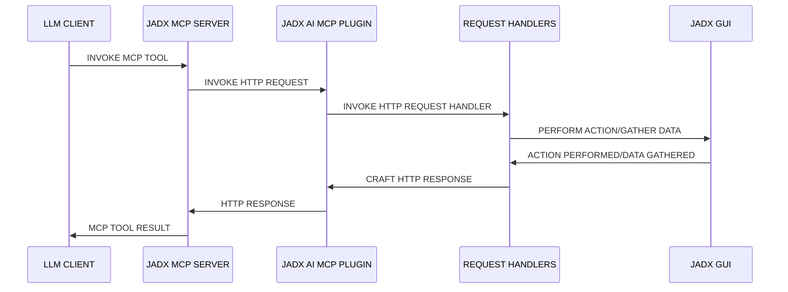

<div align="center">

# JADX-AI-MCP (Part of Zin MCP Suite)

⚡ Fully automated MCP server + JADX plugin built to communicate with LLM through MCP to analyze Android APKs using LLMs like Claude — uncover vulnerabilities, analyze APK, and reverse engineer effortlessly.


[](http://www.apache.org/licenses/LICENSE-2.0.html)

#### ⭐ Contributors

Thanks to these wonderful people for their contributions ⭐
<table>
  <tr align="center">
  <td>
      <a href="https://github.com/ljt270864457">
        
        <br /><sub><b>ljt270864457</b></sub>
      </a>
    </td>
    <td>
      <a href="https://github.com/p0px">
        
        <br /><sub><b>p0px</b></sub>
      </a>
    </td>
    <td>
      <a href="https://github.com/bx33661">
        
        <br /><sub><b>bx33661</b></sub>
      </a>
    </td>
    <td>
      <a href="https://github.com/Haicaji">
        
        <br /><sub><b>Haicaji</b></sub>
      </a>
    </td>
    <td>
      <a href="https://github.com/ChineseAStar">
        
        <br /><sub><b>ChineseAStar</b></sub>
      </a>
    </td>
    <td>
      <a href="https://github.com/cyal1r">
        
        <br /><sub><b>cyal1</b></sub>
      </a>
    </td>
    <td>
      <a href="https://github.com/badmonkey7">
        
        <br /><sub><b>badmonkey7</b></sub>
      </a>
    </td>
       <td>
      <a href="https://github.com/tiann">
        
        <br /><sub><b>tiann</b></sub>
      </a>
    </td>
    <td>
      <a href="https://github.com/ZERO-A-ONE">
        
        <br /><sub><b>ZERO-A-ONE</b></sub>
      </a>
    </td>
    <td>
      <a href="https://github.com/neoz">
        
        <br /><sub><b>neoz</b></sub>
      </a>
    </td>
    <td>
      <a href="https://github.com/SamadiPour">
        
        <br /><sub><b>SamadiPour</b></sub>
      </a>
    </td>
    <td>
      <a href="https://github.com/wuseluosi">
        
        <br /><sub><b>wuseluosi</b></sub>
      </a>
    </td>
    <td>
      <a href="https://github.com/CainYzb">
        
        <br /><sub><b>CainYzb</b></sub>
      </a>
    </td>
    <td>
      <a href="https://github.com/tbodt">
        
        <br /><sub><b>tbodt</b></sub>
      </a>
    </td>
    <td>
      <a href="https://github.com/LilNick0101">
        
        <br /><sub><b>LilNick0101</b></sub>
      </a>
    </td>
    <td>
      <a href="https://github.com/lwsinclair">
        
        <br /><sub><b>lwsinclair</b></sub>
      </a>
    </td>
  </tr>
</table>


</div>

<!-- It is a still in early stage of development, so expects bugs, crashes and logical erros.-->

<!-- Standalone Plugin for [JADX](https://github.com/skylot/jadx) (Started as Fork) with Model Context Protocol (MCP) integration for AI-powered static code analysis and real-time code review and reverse engineering tasks using Claude.-->


<div align="center">
    
</div>

<!--  Image generated using AI tools. -->

#### Read The Docs
 - Read The Docs is now live: https://jadx-ai-mcp.readthedocs.io/en/latest/

---

## 🤖 What is JADX-AI-MCP?

**JADX-AI-MCP** is a plugin for the [JADX decompiler](https://github.com/skylot/jadx) that integrates directly with [Model Context Protocol (MCP)](https://github.com/anthropic/mcp) to provide **live reverse engineering support with LLMs like Claude**.

Think: "Decompile → Context-Aware Code Review → AI Recommendations" — all in real time.

#### High Level Sequence Diagram



### Watch the demos!

- **Perform quick analysis**
  
https://github.com/user-attachments/assets/b65c3041-fde3-4803-8d99-45ca77dbe30a

- **Quickly find vulnerabilities**

https://github.com/user-attachments/assets/c184afae-3713-4bc0-a1d0-546c1f4eb57f

- **Multiple AI Agents Support**

https://github.com/user-attachments/assets/6342ea0f-fa8f-44e6-9b3a-4ceb8919a5b0

- **Run with your favorite LLM Client**

https://github.com/user-attachments/assets/b4a6b280-5aa9-4e76-ac72-a0abec73b809

- **Analyze The APK Resources**

https://github.com/user-attachments/assets/f42d8072-0e3e-4f03-93ea-121af4e66eb1

- **Your AI Assistant during debugging of APK using JADX**

https://github.com/user-attachments/assets/2b0bd9b1-95c1-4f32-9b0c-38b864dd6aec

It is combination of two tools:
1. JADX-AI-MCP
2. [JADX MCP SERVER](https://github.com/zinja-coder/jadx-mcp-server)

## 🤖 What is JADX-MCP-SERVER?

**JADX MCP Server** is a standalone Python server that interacts with a `JADX-AI-MCP` plugin (see: [jadx-ai-mcp](https://github.com/zinja-coder/jadx-ai-mcp)) via MCP (Model Context Protocol). It lets LLMs communicate with the decompiled Android app context live.

---

## Other projects in Zin MCP Suite
 - **[APKTool-MCP-Server](https://github.com/zinja-coder/apktool-mcp-server)**
 - **[JADX-MCP-Server](https://github.com/zinja-coder/jadx-mcp-server)**
 - **[ZIN-MCP-Client](https://github.com/zinja-coder/zin-mcp-client)**

## Current MCP Tools

The following MCP tools are available:

- `fetch_current_class()` — Get the class name and full source of selected class
- `get_selected_text()` — Get currently selected text
- `get_all_classes()` — List all classes in the project
- `get_class_source()` — Get full source of a given class
- `get_method_by_name()` — Fetch a method's source
- `search_method_by_name()` — Search method across classes
- `search_classes_by_keyword()` — Search for classes whose source code contains a specific keyword (supports pagination)
- `get_methods_of_class()` — List methods in a class
- `get_fields_of_class()` — List fields in a class
- `get_smali_of_class()` — Fetch smali of class
- `get_main_activity_class()` — Fetch main activity from jadx mentioned in AndroidManifest.xml file.
- `get_main_application_classes_code()` — Fetch all the main application classes' code based on the package name defined in the AndroidManifest.xml.
- `get_main_application_classes_names()` — Fetch all the main application classes' names based on the package name defined in the AndroidManifest.xml.
- `get_android_manifest()` — Retrieve and return the AndroidManifest.xml content.
- `get_manifest_component` - Retrieve specific manifest component instead of whole manifest file
- `get_strings()` : Fetches the strings.xml file
- `get_all_resource_file_names()` : Retrieve all resource files names that exists in application
- `get_resource_file()` : Retrieve resource file content
- `rename_class()` : Renames the class name
- `rename_method()` : Renames the method
- `rename_field()` : Renames the field
- `rename_package()` : Renames whole package
- `rename_variable()` : Renames the variable within a method
- `debug_get_stack_frames()` : Get the stack frames from jadx debugger
- `debug_get_threads()` : Get the insights of threads from jadx debugger
- `debug_get_variables()` : Get the variables from jadx debugger
- `xrefs_to_class()` : Find all references to a class (returns method-level and class-level references, supports pagination)
- `xrefs_to_method()` : Find all references to a method (includes override-related methods, supports pagination)
- `xrefs_to_field()` : Find all references to a field (returns methods that access the field, supports pagination)
  
---

## 🗒️ Sample Prompts

🔍 Basic Code Understanding

    "Explain what this class does in one paragraph."

    "Summarize the responsibilities of this method."

    "Is there any obfuscation in this class?"

    "List all Android permissions this class might require."

🛡️ Vulnerability Detection

    "Are there any insecure API usages in this method?"

    "Check this class for hardcoded secrets or credentials."

    "Does this method sanitize user input before using it?"

    "What security vulnerabilities might be introduced by this code?"

🛠️ Reverse Engineering Helpers

    "Deobfuscate and rename the classes and methods to something readable."

    "Can you infer the original purpose of this smali method?"

    "What libraries or SDKs does this class appear to be part of?"

    "Tell me which classes contains code related to 'encryption'?"

📦 Static Analysis

    "List all network-related API calls in this class."

    "Identify file I/O operations and their potential risks."

    "Does this method leak device info or PII?"

🤖 AI Code Modification

    "Refactor this method to improve readability."

    "Add comments to this code explaining each step."

    "Rewrite this Java method in Python for analysis."

📄 Documentation & Metadata

    "Generate Javadoc-style comments for all methods."

    "What package or app component does this class likely belong to?"

    "Can you identify the Android component type (Activity, Service, etc.)?"

🐞 Debugger Assistant
```
   "Fetch stack frames, varirables and threads from debugger and provide summary"

   "Based the stack frames from debugger, explain the execution flow of the application"

   "Based on the state of variables, is there security threat?"
```

---

## 🛠️ Getting Started 

### 1. Download from Releases: https://github.com/zinja-coder/jadx-ai-mcp/releases

> [!NOTE]
>
> Download both `jadx-ai-mcp-<version>.jar` and `jadx-mcp-server-<version>.zip` files.


```bash
# 0. Download the jadx-ai-mcp-<version>.jar and jadx-mcp-server-<version>.zip
https://github.com/zinja-coder/jadx-ai-mcp/releases

# 1. 
unzip jadx-ai-mcp-<version>.zip

├jadx-mcp-server/
  ├── jadx_mcp.py
  ├── requirements.txt
  ├── README.md
  ├── LICENSE

├jadx-ai-mcp-<version>.jar

# 2. Install the plugin

# For this you can follow two approaches:

## 1. One liner - execute below command in your shell
jadx plugins --install "github:zinja-coder:jadx-ai-mcp"

## The above one line code will install the latest version of the plugin directly into the jadx, no need to download the jadx-ai-mcp's .jar file.
## 2. Or you can use JADX-GUI to install it by following images as shown below:
```

<div align="center">
    
</div>

<div align="center">
    
</div>

<div align="center">
    
</div>


```bash
## 3. GUI method, download the .jar file and follow below steps shown in images
```


```bash
# 3. Navigate to jadx-mcp-server directory
cd jadx-mcp-server

# 4. This project uses uv - https://github.com/astral-sh/uv instead of pip for dependency management.
    ## a. Install uv (if you dont have it yet)
curl -LsSf https://astral.sh/uv/install.sh | sh
    ## b. OPTIONAL, if for any reasons, you get dependecy errors in jadx-mcp-server, Set up the environment
uv venv
source .venv/bin/activate  # or .venv\Scripts\activate on Windows
    ## c. OPTIONAL Install dependencies
uv pip install httpx fastmcp

# The setup for jadx-ai-mcp and jadx_mcp_server is done.
```

## 🤖 2. Use Claude Desktop

Make sure Claude Desktop is running with MCP enabled.

For instance, I have used following for Kali Linux: https://github.com/aaddrick/claude-desktop-debian

Configure and add MCP server to LLM file:
```bash
nano ~/.config/Claude/claude_desktop_config.json
```

For:
   - Windows: `%APPDATA%\Claude\claude_desktop_config.json`
   - macOS: `~/Library/Application Support/Claude/claude_desktop_config.json`
   
And following content in it:
```json
{
    "mcpServers": {
        "jadx-mcp-server": {
            "command": "/<path>/<to>/uv", 
            "args": [
                "--directory",
                "</PATH/TO/>jadx-mcp-server/",
                "run",
                "jadx_mcp_server.py"
            ]
        }
    }
}
```

Replace:

- `path/to/uv` with the actual path to your `uv` executable
- `path/to/jadx-mcp-server` with the absolute path to where you cloned this
repository

Then, navigate code and interact via real-time code review prompts using the built-in integration.

**OR**

or you can install the jadx_mcp_server directly as executable directly using below command:

```
uv tool install git+https://github.com/zinja-coder/jadx-mcp-server
```

and then you can just provide `jadx_mcp_server` in `command` section of mcp configuration.

## 3. Use Cherry Studio

If you want to configure the MCP tool in Cherry Studio, you can refer to the following configuration.
- Type: stdio
- command: uv
- argument:
```bash
--directory
path/to/jadx-mcp-server
run
jadx_mcp_server.py
```
- `path/to/jadx-mcp-server` with the absolute path to where you cloned this
repository

## 4. Using LMStudio

You can also use JADX AI MCP Server with LM Studio by configuring it's mcp.json file. Here's the video guide.

https://github.com/user-attachments/assets/b4a6b280-5aa9-4e76-ac72-a0abec73b809

## 5. Running in HTTP Stream Mode

You can also use Jadx in HTTP Stream Mode using `--http` option with `jadx_mcp_server.py` as shown in following:

```bash
uv run jadx_mcp_server.py --http

OR

uv run jadx_mcp_server.py --http --port 9999
```

### Advanced CLI Options — Understanding the Flags

There are **two separate connections** and each has its own host/port:

```
┌─────────────┐    --host / --port     ┌──────────────────┐   --jadx-host / --jadx-port   ┌──────────────────┐
│  LLM Client │ ◄──────────────────►   │  jadx-mcp-server │ ──────────────────────────►   │  JADX-GUI Plugin │
│  (Claude,   │   Where the MCP server │                  │   Where the MCP server looks  │  (jadx-ai-mcp)   │
│   Codex..)  │   LISTENS for clients  │                  │   for the JADX plugin         │                  │
└─────────────┘                        └──────────────────┘                               └──────────────────┘
```

| Flag | Default | Controls |
|------|---------|----------|
| `--http` | off | Use HTTP transport instead of stdio |
| `--host` | `127.0.0.1` | **Where the MCP server listens** (bind address for LLM clients) |
| `--port` | `8651` | **Which port the MCP server listens on** |
| `--jadx-host` | `127.0.0.1` | **Where to find the JADX plugin** (the target JADX-GUI machine) |
| `--jadx-port` | `8650` | **Which port the JADX plugin is on** |

### Usage Examples

**Scenario 1 — Everything on the same machine (most common):**
```bash
# Default: MCP server on localhost:8651, connects to JADX plugin on localhost:8650
uv run jadx_mcp_server.py --http
```

**Scenario 2 — Docker container or WSL (MCP server accessible from host network):**
```bash
# MCP server listens on ALL interfaces so the host can reach it
# JADX plugin is still on the same machine
uv run jadx_mcp_server.py --http --host 0.0.0.0
```

**Scenario 3 — JADX-GUI running on a different machine (e.g., remote VM):**
```bash
# MCP server runs locally, but connects to JADX plugin on a remote machine
uv run jadx_mcp_server.py --http --jadx-host 192.168.1.100
```

**Scenario 4 — Full remote setup (everything on different machines):**
```bash
# MCP server listens on all interfaces on port 9999
# JADX plugin is on a different machine at 192.168.1.100:8652
uv run jadx_mcp_server.py --http --host 0.0.0.0 --port 9999 --jadx-host 192.168.1.100 --jadx-port 8652
```

> [!CAUTION]
> ### ⚠️ Security Warning — Remote Binding
>
> When using `--host 0.0.0.0` (or any non-localhost address), the MCP server binds to **all network interfaces** over **plain HTTP with no authentication**. This means:
>
> - **Anyone on the network** can connect and invoke all MCP tools
> - There is **no TLS encryption** — traffic can be intercepted
> - An attacker can use the server to **read decompiled code**, **rename classes/methods**, and **access debug info**
>
> **Mitigations:**
> - Only bind to `0.0.0.0` on **trusted, isolated networks** (e.g., Docker bridge, local VM)
> - Use a **firewall** to restrict access to the MCP port
> - Consider an **SSH tunnel** instead: `ssh -L 8651:127.0.0.1:8651 remote-host`

### Stdio Mode Compatibility

> [!NOTE]
> When running in **stdio** mode (the default, without `--http`), all human-readable output (banner, health check) is written to **stderr** to keep **stdout** reserved for the MCP JSON-RPC stream. This ensures compatibility with Codex, Claude Desktop, and other stdio-based MCP clients.

## 6. Custom port and host configuration for JADX AI MCP Plugin


1. Configure Port: Configure the port on which the JADX AI MCP Plugin will listen on.
2. Default Port: Revert back the changes and listen on default port.
3. Restart Server: Force restart the JADX AI MCP Plugin server.
4. Server Status: Check the status of JADX AI MCP Plugin server.

To connect with JADX AI MCP Plugin running on custom port, the `--jadx-port` option will be used as shown in following:
```
uv run jadx_mcp_server.py --jadx-port 8652
```

If the JADX AI MCP Plugin is running on a **different machine** (e.g., JADX on a remote VM, MCP server on your local host), use the `--jadx-host` option:
```bash
# Connect to JADX plugin on a remote host
uv run jadx_mcp_server.py --jadx-host 192.168.1.100 --jadx-port 8650
```

### CLI Reference — Understanding the Flags

There are **two separate connections** and each has its own host/port:

```
┌─────────────┐    --host / --port     ┌──────────────────┐   --jadx-host / --jadx-port   ┌──────────────────┐
│  LLM Client │ ◄──────────────────►   │  jadx-mcp-server │ ──────────────────────────►   │  JADX-GUI Plugin │
│  (Claude,   │   Where the MCP server │                  │   Where the MCP server looks  │  (jadx-ai-mcp)   │
│   Codex..)  │   LISTENS for clients  │                  │   for the JADX plugin         │                  │
└─────────────┘                        └──────────────────┘                               └──────────────────┘
```

| Flag | Default | Controls |
|------|---------|----------|
| `--http` | off | Use HTTP transport instead of stdio |
| `--host` | `127.0.0.1` | **Where the MCP server listens** (bind address for LLM clients) |
| `--port` | `8651` | **Which port the MCP server listens on** |
| `--jadx-host` | `127.0.0.1` | **Where to find the JADX plugin** (the target JADX-GUI machine) |
| `--jadx-port` | `8650` | **Which port the JADX plugin is on** |

### Usage Examples

**Scenario 1 — Everything on the same machine (most common):**
```bash
# Default: MCP server on localhost:8651, connects to JADX plugin on localhost:8650
uv run jadx_mcp_server.py --http
```

**Scenario 2 — Docker container or WSL (MCP server accessible from host network):**
```bash
# MCP server listens on ALL interfaces so the host can reach it
# JADX plugin is still on the same machine
uv run jadx_mcp_server.py --http --host 0.0.0.0
```

**Scenario 3 — JADX-GUI running on a different machine (e.g., remote VM):**
```bash
# MCP server runs locally, but connects to JADX plugin on a remote machine
uv run jadx_mcp_server.py --http --jadx-host 192.168.1.100
```

**Scenario 4 — Full remote setup (everything on different machines):**
```bash
# MCP server listens on all interfaces on port 9999
# JADX plugin is on a different machine at 192.168.1.100:8652
uv run jadx_mcp_server.py --http --host 0.0.0.0 --port 9999 --jadx-host 192.168.1.100 --jadx-port 8652
```

The MCP Configuration for custom jadx port will be as follows for claude:

```
{
  "mcpServers": {
    "jadx-mcp-server": {
      "command": "/path/to/uv",
      "args": [
        "--directory",
        "/path/to/jadx-mcp-server/",
        "run",
        "jadx_mcp_server.py",
        "--jadx-port",
        "8652"
      ]
    }
  }
}
```

## Give it a shot

1. Run jadx-gui and load any .apk file


2. Start claude - You must see hammer symbol


3. Click on the `hammer` symbol and you should you see somthing like following:


4. Run following prompt:
```text
fetch currently selected class and perform quick sast on it
```


5. Allow access when prompted:


6. HACK!


This plugin allows total control over the GUI and internal project model to support deeper LLM integration, including:

- Exporting selected class to MCP
- Running automated Claude analysis
- Receiving back suggestions inline

---

## Troubleshooting

[Check here](https://github.com/zinja-coder/jadx-ai-mcp/edit/jadx-ai/TROUBLESHOOTING.md)

## NOTE For Contributors

 - The files related to JADX-AI-MCP can be found under this repo.

 - The files related to **jadx-mcp-server** can be found [here](https://github.com/zinja-coder/jadx-mcp-server).

## To report bugs, issues, feature suggestion, Performance issue, general question, Documentation issue.
 - Kindly open an issue with respective template.

 - Tested on Claude Desktop Client, support for other AI will be tested soon!

## 🙏 Credits

This project is a plugin for JADX, an amazing open-source Android decompiler created and maintained by [@skylot](https://github.com/skylot). All core decompilation logic belongs to them. I have only extended it to support my MCP server with AI capabilities.

[📎 Original README (JADX)](https://github.com/skylot/jadx)

The original README.md from jadx is included here in this repository for reference and credit.

This MCP server is made possible by the extensibility of JADX-GUI and the amazing Android reverse engineering community.

Also huge thanks to [@aaddrick](https://github.com/aaddrick) for developing Claude desktop for Debian based linux.

And in last thanks to [@anthropics](https://github.com/anthropics) for developing the Model Context Protocol and [@FastMCP](https://github.com/modelcontextprotocol/python-sdk) team

Apart from this, huge thanks to all open source projects which serve as a dependencies for this project and which made this possible.

### Dependencies

This project uses following awesome libraries.

- Plugin - Java
  - Javalin     - https://javalin.io/ - Apache 2.0 License
  - SLF4J       - https://slf4j.org/  - MIT License
  - org.w3c.dom - https://mvnrepository.com/artifact/org.w3c.dom - W3C Software and Document License

- MCP Server - Python
  - FastMCP - https://github.com/jlowin/fastmcp - Apache 2.0 License
  - httpx   - https://www.python-httpx.org      - BSD-3-Clause (“BSD licensed”) 

## 📄 License

JADX-AI-MCP and all related projects inherits the Apache 2.0 License from the original JADX repository.

## ⚖️ Legal Warning

**Disclaimer**

The tools `jadx-ai-mcp` and `jadx_mcp_server` are intended strictly for educational, research, and ethical security assessment purposes. They are provided "as-is" without any warranties, expressed or implied. Users are solely responsible for ensuring that their use of these tools complies with all applicable laws, regulations, and ethical guidelines.

By using `jadx-ai-mcp` or `jadx_mcp_server`, you agree to use them only in environments you are authorized to test, such as applications you own or have explicit permission to analyze. Any misuse of these tools for unauthorized reverse engineering, infringement of intellectual property rights, or malicious activity is strictly prohibited.

The developers of `jadx-ai-mcp` and `jadx_mcp_server` shall not be held liable for any damage, data loss, legal consequences, or other consequences resulting from the use or misuse of these tools. Users assume full responsibility for their actions and any impact caused by their usage.

Use responsibly. Respect intellectual property. Follow ethical hacking practices.

---

## 🙌 Contribute or Support

- Found it useful? Give it a ⭐️
- Got ideas? Open an [issue](https://github.com/zinja-coder/jadx-ai-mcp/issues) or submit a PR
- Built something on top? DM me or mention me — I’ll add it to the README!
- Do you like my work and keep it going? Sponsor this project.
  
---

Built with ❤️ for the reverse engineering and AI communities.
